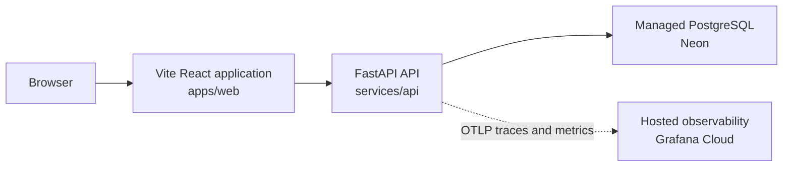

# Current architecture

This document describes only what is present in the repository now.



Plain-text alternative:

```text
browser -> Vite React application -> FastAPI API -> Neon PostgreSQL
                                      `-> OTLP traces/metrics -> Grafana Cloud
```

The frontend loads the backend-owned demo scenario catalog, posts a validated
connector request, and renders the backend-owned merge-readiness decision plus
its supporting GitHub and Jira fixture evidence. The API also serves
`GET /health`.

```text
GET  /v1/demo/pull-request-scenarios -> selectable fixture metadata
POST /v1/pull-request-inspections    -> combined GitHub and Jira facts
POST /v1/pull-request-merge-readiness -> runtime run, policy result, and facts
GET  /v1/runs/{run_id}               -> persisted typed runtime run
```

Browser code calls relative `/v1` URLs. Vite proxies that prefix to the local
API during development; a production ingress or web server must provide the
same routing contract.

## Responsibilities

| Path | Current responsibility |
| --- | --- |
| `apps/web` | Browser UI, runtime response validation, backend fixture selection, request submission, and evidence presentation |
| `services/api` | Backend HTTP boundary, fake and live GitHub connectors, deterministic Jira fixtures, asynchronous workflow execution, PostgreSQL persistence, and pure merge-readiness policy |
| `packages` | Reserved for reusable TypeScript packages; not yet present |
| `docs` | Product, architecture, testing, decisions, work records, and learning |
| `infra` | Reserved for future infrastructure configuration; not yet present |
| `scripts` | Reserved for future repository automation; not yet present |

## Connector inspection module map

The implemented slice is organized so each module answers one question:

```text
services/api/app/
├── connectors/
│   ├── models.py             # What are valid provider facts?
│   ├── fixture_catalog.py    # Which demo scenarios exist?
│   ├── github_fixtures.py    # What GitHub facts belong to each scenario?
│   ├── jira_fixtures.py      # What Jira facts belong to each scenario?
│   ├── fakes.py              # How are fixtures looked up?
│   └── errors.py             # How does lookup failure leave this boundary?
├── inspection/
│   ├── models.py             # What combined application results exist?
│   └── service.py            # How are GitHub and Jira calls coordinated?
├── policy/
│   ├── models.py             # What typed readiness conclusions exist?
│   └── evaluator.py          # How do provider facts become a decision?
├── runtime/
│   ├── models.py             # What run and step snapshots are valid?
│   ├── state.py              # Which lifecycle transitions are allowed?
│   └── repository.py         # How can run storage be replaced later?
├── workflows/
│   └── merge_readiness.py    # How are connector and policy steps executed?
├── api/v1/
│   ├── models.py             # What HTTP-specific error bodies exist?
│   └── connector_router.py   # Which URLs expose the use case?
└── main.py                   # How is the FastAPI application assembled?
```

Durable execution adds these backend modules beside that domain map:

```text
services/api/
├── app/config.py                         # Safe DATABASE_URL parsing
├── app/database/engine.py                # Engine, pool, and sessions
├── app/database/models.py                # Relational tables and constraints
├── app/database/postgres_run_repository.py # Typed snapshot persistence
├── app/runtime/errors.py                 # Sanitized persistence failures
└── migrations/                           # Alembic schema history
```

Runtime observability adds a provider-neutral boundary:

```text
services/api/app/observability/
|-- contracts.py                 # Closed attributes, labels, and categories
|-- runtime_telemetry.py         # Domain spans, metrics, and terminal events
|-- observed_run_repository.py   # Storage decorator and checkpoint spans
|-- structured_logging.py        # Safe correlated JSON events
`-- setup.py                     # Providers, exporters, FastAPI setup, shutdown
```

```text
apps/web/src/features/inspection/
├── types.ts                  # What data shapes exist in TypeScript?
├── requestValidation.ts      # How does form text become a request?
├── responseValidation.ts     # How is unknown network JSON proven safe?
├── apiError.ts               # How are client failures represented?
├── api.ts                    # How does the browser call /v1?
├── MergeReadinessPage.tsx     # How do analysis UI states transition?
└── components/
    ├── RequestForm.tsx       # How is request input rendered?
    └── MergeReadinessPanel.tsx # How are decisions and evidence rendered?
```

## Dependency and ownership boundaries

- Bun owns JavaScript and TypeScript dependencies and workspace scripts.
- `apps/web` owns browser implementation and its React/Vite dependencies.
- uv owns dependencies declared in `services/api/pyproject.toml`.
- `services/api` owns backend behavior and does not use Bun for Python packages.
- No shared TypeScript package currently exists; introduce one only for a
  concrete cross-package need.
- External browser and future connector data must be validated at their system
  boundaries.
- The API contains frozen Pydantic contracts, deterministic in-memory GitHub
  and Jira fakes, and an asynchronous read-only GitHub REST connector. The
  default `fake` mode remains credential-free; explicit `github` mode requires
  a token and never falls back to fixture data.
- `GET /v1/demo/pull-request-scenarios` is explicitly demo-only. The separate
  raw-inspection route remains fixture-only. The merge-readiness workflow uses
  the application-selected GitHub connector.
- Raw inspection routes delegate to `app.inspection.service`. The readiness
  route delegates to `MergeReadinessWorkflowService`; routes contain neither
  connector sequencing nor policy rules.
- `app.policy.evaluate_merge_readiness` is a pure domain function. It accepts
  typed GitHub and Jira facts, performs no connector or infrastructure calls,
  and returns every verified blocker plus explicit missing information and
  evidence references. `POST /v1/pull-request-merge-readiness` invokes it after
  recorded connector steps; the older inspection endpoint remains facts-only.
- `GitHubConnector` is an asynchronous protocol shared by fake and HTTP
  implementations. The application factory reads validated settings and
  injects one implementation; the workflow neither knows nor branches on the
  source. Raw REST JSON is validated and normalized inside `github_http.py`.
- Required checks and approvals are facts only when branch rules or protection
  evidence supplies their requirements. Missing permissions or indeterminate
  evidence produces an `unknown` policy result unless another verified blocker
  exists. GitHub's nullable `mergeable` field is likewise indeterminate.
- Live GitHub mode uses `UnavailableJiraConnector` because a Jira HTTP connector
  remains out of scope. Therefore a live run normally has missing Jira evidence;
  it can still be `blocked` by verified GitHub facts but cannot be `ready`.
- The basic runtime creates a unique run, records three ordered steps, enforces
  terminal state transitions, and returns immutable Pydantic snapshots. A
  completed run contains `result`; a failed run returns HTTP `500`, contains a
  sanitized error, and has `result=null`.
- `RunRepository` isolates workflow execution from storage. Production route
  dependencies require `PostgresRunRepository`; memory is available only when
  unit and HTTP tests inject it explicitly.
- One application-lifetime SQLAlchemy engine owns a small connection pool.
  Repository methods open short transactions and release their sessions before
  GitHub, Jira, or policy work begins. PostgreSQL stores run identity, status,
  timestamps, workflow version, and step ordering relationally. Request,
  connector facts, typed result, and sanitized errors are JSONB snapshots that
  are revalidated through Pydantic on retrieval.
- Alembic owns schema creation. Application startup validates connectivity and
  required tables but never runs migrations or calls `create_all()`.
- Terminal step and terminal run state are saved in one transaction. The API
  returns `200` only after a completed result commits, `500` only after a failed
  run commits, and sanitized `503` when durability cannot be confirmed.
- One FastAPI server span parents a manual workflow span, three step spans, and
  explicit persistence spans. `run_id` may correlate spans and safe JSON logs,
  but IDs and user-controlled values are forbidden metric labels. Terminal run
  measurements and logs occur only after the terminal database commit.
- OpenTelemetry exports traces and metrics through OTLP HTTP/protobuf when
  explicitly enabled. Grafana Cloud is configuration, not a domain dependency;
  setup and exporter failures degrade safely without changing HTTP, runtime,
  policy, or persistence behavior.
- Frontend network data remains `unknown` until `responseValidation.ts` proves
  the expected runtime structure.

## Not implemented

Crash recovery, cancellation APIs, retries, distributed workers, queues, a Jira
HTTP connector, GitHub OAuth or App authentication, tenant isolation, retention,
LLMOps, dashboards, alerting, OpenTelemetry log export, and evaluations are not
implemented. Neon/Grafana resources and application deployment are not
provisioned by this repository.
