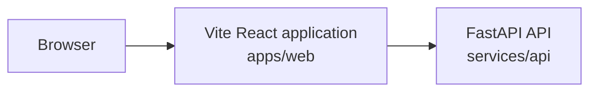

# Current architecture

This document describes only what is present in the repository now.



Plain-text alternative:

```text
browser -> Vite React application (apps/web) -> FastAPI API (services/api)
```

This is the intended request boundary. The starter frontend does not yet call
the API; the API currently serves `GET /health`.

## Responsibilities

| Path | Current responsibility |
| --- | --- |
| `apps/web` | Browser UI, frontend state, and presentation; currently the Vite starter |
| `services/api` | Backend HTTP boundary; currently FastAPI with a health endpoint |
| `packages` | Reserved for reusable TypeScript packages; not yet present |
| `docs` | Product, architecture, testing, decisions, work records, and learning |
| `infra` | Reserved for future infrastructure configuration; not yet present |
| `scripts` | Reserved for future repository automation; not yet present |

## Dependency and ownership boundaries

- Bun owns JavaScript and TypeScript dependencies and workspace scripts.
- `apps/web` owns browser implementation and its React/Vite dependencies.
- uv owns dependencies declared in `services/api/pyproject.toml`.
- `services/api` owns backend behavior and does not use Bun for Python packages.
- No shared TypeScript package currently exists; introduce one only for a
  concrete cross-package need.
- External browser and future connector data must be validated at their system
  boundaries.

## Not implemented

The agent runtime, persistence, connectors, authentication and authorization,
tenant isolation, LLMOps, and evaluations are planned areas only. No database,
queue, cache, cloud service, or deployed runtime component is present.
