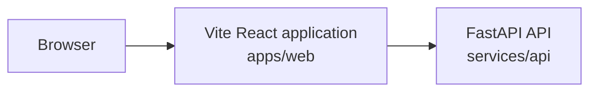

# Current architecture

This document describes only what is present in the repository now.



Plain-text alternative:

```text
browser -> Vite React application (apps/web) -> FastAPI API (services/api)
```

The frontend loads the backend-owned demo scenario catalog, posts a validated
connector request, and renders the backend-owned merge-readiness decision plus
its supporting GitHub and Jira fixture evidence. The API also serves
`GET /health`.

```text
GET  /v1/demo/pull-request-scenarios -> selectable fixture metadata
POST /v1/pull-request-inspections    -> combined GitHub and Jira facts
POST /v1/pull-request-merge-readiness -> policy result plus supporting facts
```

Browser code calls relative `/v1` URLs. Vite proxies that prefix to the local
API during development; a production ingress or web server must provide the
same routing contract.

## Responsibilities

| Path | Current responsibility |
| --- | --- |
| `apps/web` | Browser UI, runtime response validation, backend fixture selection, request submission, and evidence presentation |
| `services/api` | Backend HTTP boundary, connector contracts, deterministic fixtures, V1 inspection orchestration, and pure merge-readiness policy |
| `packages` | Reserved for reusable TypeScript packages; not yet present |
| `docs` | Product, architecture, testing, decisions, work records, and learning |
| `infra` | Reserved for future infrastructure configuration; not yet present |
| `scripts` | Reserved for future repository automation; not yet present |

## Connector inspection module map

The implemented slice is organized so each module answers one question:

```text
services/api/app/
├── connectors/
│   ├── models.py             # What are valid provider facts?
│   ├── fixture_catalog.py    # Which demo scenarios exist?
│   ├── github_fixtures.py    # What GitHub facts belong to each scenario?
│   ├── jira_fixtures.py      # What Jira facts belong to each scenario?
│   ├── fakes.py              # How are fixtures looked up?
│   └── errors.py             # How does lookup failure leave this boundary?
├── inspection/
│   ├── models.py             # What combined application results exist?
│   └── service.py            # How are GitHub and Jira calls coordinated?
├── policy/
│   ├── models.py             # What typed readiness conclusions exist?
│   └── evaluator.py          # How do provider facts become a decision?
├── api/v1/
│   ├── models.py             # What HTTP-specific error bodies exist?
│   └── connector_router.py   # Which URLs expose the use case?
└── main.py                   # How is the FastAPI application assembled?
```

```text
apps/web/src/features/inspection/
├── types.ts                  # What data shapes exist in TypeScript?
├── requestValidation.ts      # How does form text become a request?
├── responseValidation.ts     # How is unknown network JSON proven safe?
├── apiError.ts               # How are client failures represented?
├── api.ts                    # How does the browser call /v1?
├── MergeReadinessPage.tsx     # How do analysis UI states transition?
└── components/
    ├── RequestForm.tsx       # How is request input rendered?
    └── MergeReadinessPanel.tsx # How are decisions and evidence rendered?
```

## Dependency and ownership boundaries

- Bun owns JavaScript and TypeScript dependencies and workspace scripts.
- `apps/web` owns browser implementation and its React/Vite dependencies.
- uv owns dependencies declared in `services/api/pyproject.toml`.
- `services/api` owns backend behavior and does not use Bun for Python packages.
- No shared TypeScript package currently exists; introduce one only for a
  concrete cross-package need.
- External browser and future connector data must be validated at their system
  boundaries.
- The API contains frozen Pydantic contracts and deterministic in-memory GitHub
  and Jira fakes for connector development. The V1 HTTP routes expose only
  fictional fixture metadata and results; they do not call external systems.
- `GET /v1/demo/pull-request-scenarios` is explicitly demo-only. The separate
  inspection contract can remain when real connectors replace the fakes.
- HTTP routes delegate orchestration to `app.inspection.service`; routes do not
  construct provider responses directly.
- `app.policy.evaluate_merge_readiness` is a pure domain function. It accepts
  typed GitHub and Jira facts, performs no connector or infrastructure calls,
  and returns every verified blocker plus explicit missing information and
  evidence references. `POST /v1/pull-request-merge-readiness` invokes it after
  connector retrieval; the older inspection endpoint remains facts-only.
- Frontend network data remains `unknown` until `responseValidation.ts` proves
  the expected runtime structure.

## Not implemented

The agent runtime, persistence, real connectors,
authentication and authorization, tenant isolation, LLMOps, and evaluations
are planned areas only. No database, queue, cache, cloud service, or deployed
runtime component is present.
