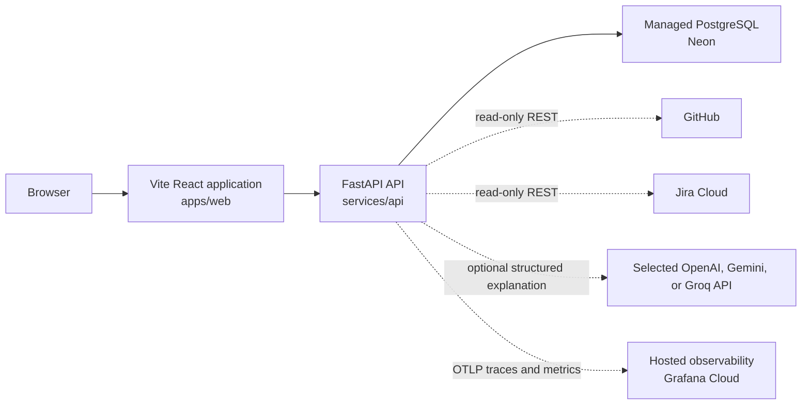

# Current architecture

This document describes only what is present in the repository now.



Plain-text alternative:

```text
browser -> Vite React application -> FastAPI API -> Neon PostgreSQL
                                      `-> optional selected LLM provider
                                      `-> OTLP traces/metrics -> Grafana Cloud
```

The frontend loads the backend-owned demo scenario catalog, starts or
synchronously executes a validated connector request, and renders the
backend-owned merge-readiness decision plus its supporting GitHub and Jira
fixture evidence. A developer run page repeatedly reads the persisted current
snapshot for an accepted run. The API also serves `GET /health`.

```text
GET  /v1/demo/pull-request-scenarios -> selectable fixture metadata
POST /v1/pull-request-inspections    -> combined GitHub and Jira facts
POST /v1/pull-request-merge-readiness -> runtime run, policy result, and facts
POST /v1/pull-request-merge-readiness-runs -> accepted pending run ID (202)
GET  /v1/runs/{run_id}               -> persisted typed runtime run
```

Browser code calls relative `/v1` URLs. Vite proxies that prefix to the local
API during development; a production ingress or web server must provide the
same routing contract.

## Responsibilities

| Path | Current responsibility |
| --- | --- |
| `apps/web` | Browser UI, runtime response validation, backend fixture selection, synchronous/live request submission, snapshot polling, and evidence presentation |
| `services/api` | Backend HTTP boundary, independently selected fake/live GitHub and Jira connectors, asynchronous workflow execution, PostgreSQL persistence, and pure merge-readiness policy |
| `packages` | Reserved for reusable TypeScript packages; not yet present |
| `docs` | Product, architecture, testing, decisions, work records, and learning |
| `infra` | Reserved for future infrastructure configuration; not yet present |
| `scripts` | Reserved for future repository automation; not yet present |

## Connector inspection module map

The implemented slice is organized so each module answers one question:

```text
services/api/app/
├── connectors/
│   ├── models.py             # What are valid provider facts?
│   ├── fixture_catalog.py    # Which demo scenarios exist?
│   ├── github_fixtures.py    # What GitHub facts belong to each scenario?
│   ├── jira_fixtures.py      # What Jira facts belong to each scenario?
│   ├── fakes.py              # How are fixtures looked up?
│   └── errors.py             # How does lookup failure leave this boundary?
├── inspection/
│   ├── models.py             # What combined application results exist?
│   └── service.py            # How are GitHub and Jira calls coordinated?
├── policy/
│   ├── models.py             # What typed readiness conclusions exist?
│   └── evaluator.py          # How do provider facts become a decision?
├── runtime/
│   ├── models.py             # What run and step snapshots are valid?
│   ├── state.py              # Which lifecycle transitions are allowed?
│   └── repository.py         # How can run storage be replaced later?
├── workflows/
│   └── merge_readiness.py    # How are connector and policy steps executed?
├── api/v1/
│   ├── models.py             # What HTTP-specific error bodies exist?
│   └── connector_router.py   # Which URLs expose the use case?
└── main.py                   # How is the FastAPI application assembled?
```

Durable execution adds these backend modules beside that domain map:

```text
services/api/
├── app/config.py                         # Safe DATABASE_URL parsing
├── app/database/engine.py                # Engine, pool, and sessions
├── app/database/models.py                # Relational tables and constraints
├── app/database/postgres_run_repository.py # Typed snapshot persistence
├── app/runtime/errors.py                 # Sanitized persistence failures
└── migrations/                           # Alembic schema history
```

Runtime observability adds a provider-neutral boundary:

```text
services/api/app/observability/
|-- contracts.py                 # Closed attributes, labels, and categories
|-- runtime_telemetry.py         # Domain spans, metrics, and terminal events
|-- observed_run_repository.py   # Storage decorator and checkpoint spans
|-- structured_logging.py        # Safe correlated JSON events
`-- setup.py                     # Providers, exporters, FastAPI setup, shutdown
```

Internal merge-readiness explanation adds a provider-neutral model boundary:

```text
services/api/app/explanations/
|-- models.py                    # Minimized input and structured output
|-- protocols.py                 # LLMClient operation contract
|-- fakes.py                     # Deterministic local/test implementation
|-- factory.py                   # Application-boundary provider selection
|-- openai_client.py             # Async Responses Structured Output adapter
|-- gemini_client.py             # Google compatibility adapter and compact claims
|-- groq_client.py               # Groq strict JSON Schema compatibility adapter
|-- errors.py                    # Typed sanitized failure categories
|-- validator.py                # Ground generated codes in policy facts
|-- templates.py                # Render approved user-facing wording
`-- service.py                   # Generation, parsing, validation, rendering
```

A manually invoked, versioned eval boundary reuses that production path without
entering FastAPI or application persistence:

```text
services/api/app/evals/
|-- cases.py                     # Development and untouched holdout inputs
|-- models.py                    # Typed observations, metrics, reports, baselines
|-- observation.py               # One production adapter/parser/validator attempt
|-- graders.py                   # Pure sets, rates, reliability, thresholds
|-- reporting.py                 # Safe JSONL/JSON, summaries, comparisons
`-- runner.py                    # Repeated samples, pacing, gates, and CLI
```

The logical prompt is `merge-readiness-explanation` version `v1`. The eleven
inspected Stage 1 cases are `merge-readiness-development-v1`; six unexecuted
variations form `merge-readiness-holdout-v1`. Expected claims always come from
the pure policy and shared `required_explanation_claims()` function.

`runner.py` defaults to three serial samples per case and a one-second delay
between calls. Pacing is outside measured provider latency and never retries a
failure. Every call becomes one observation. `graders.py` keeps all attempts in
provider/attempt denominators but includes only returned candidates in model-
quality denominators. The completed report separately states execution,
quality-threshold, operational-threshold, and combined release outcomes.

JSONL observations flush incrementally under ignored `local-artifacts/`; a
typed JSON report and optional compatible baseline are written after grading.
Normal holdout artifacts and console output contain aggregates only. Explicit
`--debug-holdout-details` reveals per-case holdout claims and therefore spends
that holdout. No artifact contains prompts, generated prose, connector
payloads, repository/Jira identity, credentials, raw responses, exception text,
or cost without explicit versioned pricing configuration.

```text
apps/web/src/features/inspection/
├── types.ts                  # What data shapes exist in TypeScript?
├── requestValidation.ts      # How does form text become a request?
├── responseValidation.ts     # How is unknown network JSON proven safe?
├── apiError.ts               # How are client failures represented?
├── api.ts                    # How does the browser call /v1?
├── MergeReadinessPage.tsx     # How do analysis UI states transition?
└── components/
    ├── RequestForm.tsx       # How is request input rendered?
    └── MergeReadinessPanel.tsx # How are decisions and evidence rendered?
```

## Dependency and ownership boundaries

- Bun owns JavaScript and TypeScript dependencies and workspace scripts.
- `apps/web` owns browser implementation and its React/Vite dependencies.
- uv owns dependencies declared in `services/api/pyproject.toml`.
- `services/api` owns backend behavior and does not use Bun for Python packages.
- No shared TypeScript package currently exists; introduce one only for a
  concrete cross-package need.
- External browser and future connector data must be validated at their system
  boundaries.
- The API contains frozen Pydantic contracts, deterministic in-memory GitHub
  and Jira fakes, and asynchronous read-only REST connectors for GitHub and
  Jira Cloud. Both default to credential-free `fake` mode and neither live mode
  falls back to fixture data.
- `GET /v1/demo/pull-request-scenarios` is explicitly demo-only. The separate
  raw-inspection route remains fixture-only. The merge-readiness workflow uses
  the application-selected GitHub connector.
- Raw inspection routes delegate to `app.inspection.service`. The readiness
  route delegates to `MergeReadinessWorkflowService`; routes contain neither
  connector sequencing nor policy rules.
- `app.policy.evaluate_merge_readiness` is a pure domain function. It accepts
  typed GitHub and Jira facts, performs no connector or infrastructure calls,
  and returns every verified blocker plus explicit missing information and
  evidence references. `POST /v1/pull-request-merge-readiness` invokes it after
  recorded connector steps; the older inspection endpoint remains facts-only.
- `MergeReadinessExplanationService` accepts only a completed
  `MergeReadinessResult`. It minimizes that result to stable decision,
  reason, and action enums before calling an injected `LLMClient`. Application
  assembly selects the deterministic fake by default or an explicitly
  configured async `OpenAILLMClient`, `GeminiLLMClient`, or `GroqLLMClient`.
  The OpenAI adapter uses Responses
  Structured Outputs with `store=False`, a configured timeout/token limit, and
  SDK retries disabled. Pydantic validates generated structure, then
  `StrictMergeReadinessExplanationValidator` requires the generated
  decision/reason/action codes to be supported and complete relative to the
  full policy result. Generated prose is discarded. Approved templates render
  the existing API/frontend explanation after a terminal run commits or is
  retrieved; explanations are not persisted.
- `GitHubConnector` is an asynchronous protocol shared by fake and HTTP
  implementations. The application factory reads validated settings and
  injects one implementation; the workflow neither knows nor branches on the
  source. Raw REST JSON is validated and normalized inside `github_http.py`.
- `JiraConnector` is an asynchronous key-based protocol. GitHub owns issue-key
  extraction; the workflow passes the validated key to the independently
  selected Jira connector. Raw Jira JSON and Basic authentication remain inside
  `jira_http.py` and the application factory.
- Required checks and approvals are facts only when branch rules or protection
  evidence supplies their requirements. Missing permissions or indeterminate
  evidence produces an `unknown` policy result unless another verified blocker
  exists. GitHub's nullable `mergeable` field is likewise indeterminate.
- Jira custom status names are display evidence only. Jira status-category keys
  normalize to the existing to-do, in-progress, and done facts consumed by the
  pure policy. Standard Jira has no universal blocker field, so live Jira marks
  blocker evidence unknown rather than inventing a site-specific fact. V1
  treats this metadata as optional: an explicit `BLOCKED` fact blocks, while
  `UNKNOWN` remains visible in evidence but creates neither missing required
  information nor a retry action.
- GitHub and Jira source modes are selected independently, supporting all four
  fake/live combinations. A bounded `runtime.connector_sources.selected`
  startup event makes the selected pair visible in server logs, and connector
  spans identify the source used by each operation. `RunSources` persists the
  bounded GitHub, Jira, and configured explanation source in nullable checked
  columns and exposes them through POST and GET. A read-time response uses the
  provider that actually enriched that response; old rows remain readable with
  unknown connector sources.
- The basic runtime creates a unique run, records three ordered steps, enforces
  terminal state transitions, and returns immutable Pydantic snapshots. A
  completed run contains `result`; a failed run returns HTTP `500`, contains a
  sanitized error, and has `result=null` on the synchronous route.
- `POST /v1/pull-request-merge-readiness-runs` is additive developer-facing
  execution: it first commits a pending snapshot, returns `202 Accepted` with
  its run ID, and starts the existing workflow in a process-local task. The
  task registry keeps only task references and cancels them at app shutdown; it
  is not durable execution or crash recovery. PostgreSQL snapshots committed
  before a crash remain readable.
- `RunRepository` isolates workflow execution from storage. Production route
  dependencies require `PostgresRunRepository`; memory is available only when
  unit and HTTP tests inject it explicitly.
- One application-lifetime SQLAlchemy engine owns a small connection pool.
  Repository methods open short transactions and release their sessions before
  GitHub, Jira, or policy work begins. PostgreSQL stores run identity, status,
  timestamps, workflow version, and step ordering relationally. Request,
  connector facts, typed result, and sanitized errors are JSONB snapshots that
  are revalidated through Pydantic on retrieval.
- Alembic owns schema creation. Application startup validates connectivity and
  required tables but never runs migrations or calls `create_all()`.
- Terminal step and terminal run state are saved in one transaction. The API
  returns `200` only after a completed result commits, `500` only after a failed
  run commits, and sanitized `503` when durability cannot be confirmed.
- One FastAPI server span parents a manual workflow span, three step spans, and
  explicit persistence spans. `run_id` may correlate spans and safe JSON logs,
  but IDs and user-controlled values are forbidden metric labels. Terminal run
  measurements and logs occur only after the terminal database commit.
- An independently invoked explanation call creates one
  `merge_readiness.explanation.generate` span and bounded duration/token
  metrics. Span attributes include the stable prompt ID/version, a short
  SHA-256 fingerprint of the configured model, fixed provider, operation,
  result, sanitized failure, and token counts. Operators can compare the
  fingerprint with their known deployment configuration without exporting an
  arbitrary environment value.
  Model and prompt identity never become metric labels. Prompts, outputs,
  repository/Jira identities, request IDs, credentials, and exception text are
  excluded.
- OpenTelemetry exports traces and metrics through OTLP HTTP/protobuf when
  explicitly enabled. Grafana Cloud is configuration, not a domain dependency;
  setup and exporter failures degrade safely without changing HTTP, runtime,
  policy, or persistence behavior.
- Frontend network data remains `unknown` until `responseValidation.ts` proves
  the expected runtime structure. The parser accepts pending, running,
  completed, failed, and cancelled snapshots as distinct unions. The dashboard
  shows run ID, status, ordered steps, timing, source provenance, sanitized
  failures, final backend result, and a pretty-printed copy of the validated
  run without deriving a policy decision.

## Live run dashboard

`GET /v1/runs/{run_id}` means **the persisted current workflow snapshot**. The
live dashboard at `/runs/:runId` observes that state by issuing a serialized
GET request about once per second while the snapshot is `pending` or `running`.
It stops once the snapshot is `completed`, `failed`, or `cancelled`, and also
stops and aborts its request on route change or component unmount. A temporary
refresh failure remains a dashboard refresh notice; it never changes a
workflow's backend-owned status to `failed`.

The page can open any existing persisted ID, including after a browser refresh.
It does not keep critical run state only in React memory. The immediate live
flow is:

```text
browser POST live-start -> PostgreSQL pending snapshot -> 202 {run_id, pending}
browser navigate /runs/:runId -> repeated GET snapshot -> validated dashboard
in-process task -> existing workflow transitions -> PostgreSQL current snapshot
```

Vite development supplies the SPA history fallback for `/runs/*`; a production
web server must serve the same application entry point for bookmarked or
refreshed run URLs before the browser can make its relative `/v1` requests.

This is state, not an event architecture: state says what is true now; an event
says what happened. V2 may add durable `RunEvent` history and an SSE stream
alongside snapshots when replay, recovery, or high-fan-out updates justify it.
The dashboard neither queries Grafana nor exposes OTel spans. Grafana/OTel
remains operational telemetry; the dashboard is product/runtime visibility.

## Not implemented

Crash recovery, cancellation APIs, retries, distributed workers, queues, GitHub
or Jira OAuth/app authentication, multi-tenant connector credentials,
site-specific Jira blocker mapping, tenant isolation, retention, explanation
persistence, LLM retries/fallback, prompt optimization, hosted eval services,
LLM-as-a-judge, production-traffic eval collection, dashboards, alerting, and
OpenTelemetry log export are not implemented. Neon/Grafana resources and
application deployment are not provisioned by this repository. The local eval
harness exists, but no Stage 2 development or holdout provider run has been
authorized or executed.

## Validated explanation response boundary

Completed merge-readiness POST and GET responses add a non-authoritative
explanation after the durable policy run is loaded or committed.
`MergeReadinessExplanationService` sends only policy decision and stable
reason/action codes to the injected client. Generated output is parsed as an
untrusted `GeneratedExplanation`; its codes must exactly cover the policy's
required code sets without inventions, omissions, duplicates, or
contradictions. The code-only `ValidatedExplanation` is rendered through
backend-owned templates before `MergeReadinessResponse` exposes it. The
frontend validates the unchanged network shape and renders it separately from
the authoritative policy result.

The explanation is produced by `FakeLLMClient` by default or by the optional
`OpenAILLMClient` or `GeminiLLMClient` when explicitly configured. Validation or provider failure
returns a sanitized `explanation_error` while the completed policy run remains
usable. Explanations are not persisted, so POST enrichment and later GET
retrieval can each make a provider call in a real-provider mode. Persisting/versioning
accepted explanations remains a separate architectural decision.

## Explanation provider boundary

`LLMSettings.from_environment()` validates the provider before application
startup. `create_llm_client()` is the only production selection point:

```text
PROMPTQL_LLM_PROVIDER=fake
  -> FakeLLMClient

PROMPTQL_LLM_PROVIDER=openai + key + model
  -> AsyncOpenAI(max_retries=0)
  -> OpenAILLMClient.generate_structured()
  -> responses.parse(text_format=GeneratedExplanation, store=False)
  -> LLMStructuredResponse

PROMPTQL_LLM_PROVIDER=gemini + Gemini key + model
  -> AsyncOpenAI(base_url=fixed Google compatibility URL, max_retries=0)
  -> GeminiLLMClient.generate_structured()
  -> beta.chat.completions.parse(response_format=GeneratedExplanation)
  -> LLMStructuredResponse

PROMPTQL_LLM_PROVIDER=groq + Groq key + model
  -> AsyncOpenAI(base_url="https://api.groq.com/openai/v1", max_retries=0)
  -> GroqLLMClient.generate_structured()
  -> beta.chat.completions.parse(response_format=GeneratedExplanation)
  -> LLMStructuredResponse
```

The SDK client owns HTTP/authentication and provider response parsing. The
adapter owns minimized serialization and provider-error normalization. The
provider-neutral service owns orchestration and telemetry. The deterministic
validator owns semantic grounding, and backend templates own every visible
word. This division keeps a schema-valid model response from becoming an
authoritative business result.

Gemini and Groq have explicit provider identities and provider-specific
configuration rather than reusing OpenAI names. Both compatibility URLs are
fixed in the factory, so environment configuration cannot redirect either
provider's secret to an arbitrary host. All adapters feed the same
provider-neutral structured result into the unchanged deterministic validator;
generated prose is never exposed. Groq's bounded identity is also accepted by
the existing durable run-source column after migration `20260816_0003`.

Groq Chat Completions receives `GeneratedExplanation` as the Pydantic response
format. The installed OpenAI SDK converts that model into a strict JSON Schema;
Groq currently supports strict mode for `openai/gpt-oss-20b` and
`openai/gpt-oss-120b`. PromptQL still revalidates the parsed object and then
proves semantic support and completeness deterministically. API compatibility
therefore does not make Groq an OpenAI provider or make generated claims
authoritative.

Google's compatibility layer rejects the complete `GeneratedExplanation` JSON
Schema because its enum and length constraints create too many serving states.
`GeminiStructuredClaims` therefore asks the provider for a decision, an internal
summary, and integer indexes into request-specific allowed reason/action lists.
The adapter rejects duplicate or out-of-range indexes, maps accepted positions
back to the original typed codes, and then builds the unchanged strict
`GeneratedExplanation`. Every enum, length bound, completeness rule, and later
semantic grounding check still applies before anything can be rendered.

Google may also report an invalid Gemini API key as HTTP 400 `INVALID_ARGUMENT`
instead of HTTP 401. `GeminiLLMClient` recognizes only Google's exact nested
invalid-key response and normalizes it to the existing `authentication`
category. `MergeReadinessExplanationService` emits one safe
`llm.explanation.failed` event containing only the bounded provider and failure
category; the public response remains the generic `provider_failure` contract.
