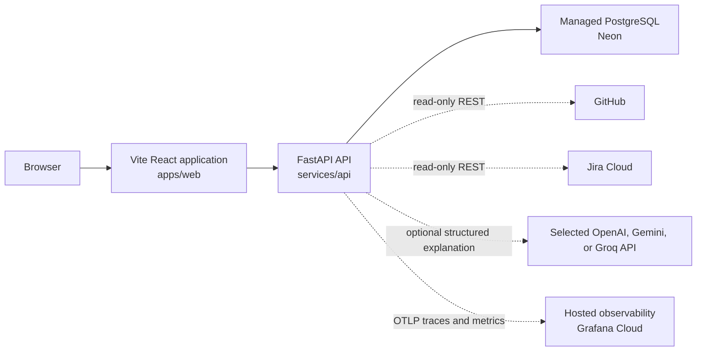

# Current architecture

This document describes only what is present in the repository now.



Plain-text alternative:

```text
browser -> Vite React application -> FastAPI API -> Neon PostgreSQL
                                      `-> optional selected LLM provider
                                      `-> OTLP traces/metrics -> Grafana Cloud
```

The frontend loads the backend-owned demo scenario catalog, starts or
synchronously executes a validated connector request, and renders the
backend-owned merge-readiness decision plus its supporting GitHub and Jira
fixture evidence. A developer run page repeatedly reads the persisted current
snapshot for an accepted run. The API also serves `GET /health`.

```text
GET  /v1/demo/pull-request-scenarios -> selectable fixture metadata
POST /v1/pull-request-inspections    -> combined GitHub and Jira facts
POST /v1/pull-request-merge-readiness -> runtime run, policy result, and facts
POST /v1/pull-request-merge-readiness-runs -> accepted pending run ID (202)
GET  /v1/runs/{run_id}               -> persisted typed runtime run
```

Browser code calls relative `/v1` URLs. Vite proxies that prefix to the local
API during development; a production ingress or web server must provide the
same routing contract.

## Responsibilities

| Path | Current responsibility |
| --- | --- |
| `apps/web` | Browser UI, runtime response validation, backend fixture selection, synchronous/live request submission, snapshot polling, and evidence presentation |
| `services/api` | Backend HTTP boundary, independently selected fake/live GitHub and Jira connectors, asynchronous workflow execution, PostgreSQL persistence, and pure merge-readiness policy |
| `packages` | Reserved for reusable TypeScript packages; not yet present |
| `docs` | Product, architecture, testing, decisions, work records, and learning |
| `infra` | Reserved for future infrastructure configuration; not yet present |
| `scripts` | Reserved for future repository automation; not yet present |

## Connector inspection module map

The implemented slice is organized so each module answers one question:

```text
services/api/app/
├── connectors/
│   ├── models.py             # What are valid provider facts?
│   ├── fixture_catalog.py    # Which demo scenarios exist?
│   ├── github_fixtures.py    # What GitHub facts belong to each scenario?
│   ├── jira_fixtures.py      # What Jira facts belong to each scenario?
│   ├── fakes.py              # How are fixtures looked up?
│   └── errors.py             # How does lookup failure leave this boundary?
├── tools/
│   ├── models.py              # What stable typed tool contracts exist?
│   ├── registry.py             # Which tool definitions are discoverable?
│   ├── adapters.py             # How do tools call existing capabilities?
│   └── errors.py               # How are lookup and argument failures typed?
├── inspection/
│   ├── models.py             # What combined application results exist?
│   └── service.py            # How are GitHub and Jira calls coordinated?
├── policy/
│   ├── models.py             # What typed readiness conclusions exist?
│   └── evaluator.py          # How do provider facts become a decision?
├── runtime/
│   ├── models.py             # What run and step snapshots are valid?
│   ├── state.py              # Which lifecycle transitions are allowed?
│   └── repository.py         # How can run storage be replaced later?
├── workflows/
│   └── merge_readiness.py    # How are connector and policy steps executed?
├── api/v1/
│   ├── models.py             # What HTTP-specific error bodies exist?
│   └── connector_router.py   # Which URLs expose the use case?
└── main.py                   # How is the FastAPI application assembled?
```

Durable execution adds these backend modules beside that domain map:

```text
services/api/
├── app/config.py                         # Safe DATABASE_URL parsing
├── app/database/engine.py                # Engine, pool, and sessions
├── app/database/models.py                # Relational tables and constraints
├── app/database/postgres_run_repository.py # Typed snapshot persistence
├── app/runtime/errors.py                 # Sanitized persistence failures
└── migrations/                           # Alembic schema history
```

Runtime observability adds a provider-neutral boundary:

```text
services/api/app/observability/
|-- contracts.py                 # Closed attributes, labels, and categories
|-- runtime_telemetry.py         # Domain spans, metrics, and terminal events
|-- observed_run_repository.py   # Storage decorator and checkpoint spans
|-- structured_logging.py        # Safe correlated JSON events
`-- setup.py                     # Providers, exporters, FastAPI setup, shutdown
```

Internal merge-readiness explanation adds a provider-neutral model boundary:

```text
services/api/app/explanations/
|-- models.py                    # Minimized input and structured output
|-- protocols.py                 # LLMClient operation contract
|-- fakes.py                     # Deterministic local/test implementation
|-- factory.py                   # Application-boundary provider selection
|-- openai_client.py             # Async Responses Structured Output adapter
|-- gemini_client.py             # Google compatibility adapter and compact claims
|-- groq_client.py               # Groq strict JSON Schema compatibility adapter
|-- errors.py                    # Typed sanitized failure categories
|-- validator.py                # Ground generated codes in policy facts
|-- templates.py                # Render approved user-facing wording
`-- service.py                   # Generation, parsing, validation, rendering
```

A manually invoked, versioned eval boundary reuses that production path without
entering FastAPI or application persistence:

```text
services/api/app/evals/
|-- cases.py                     # Development and untouched holdout inputs
|-- models.py                    # Typed observations, metrics, reports, baselines
|-- observation.py               # One production adapter/parser/validator attempt
|-- graders.py                   # Pure sets, rates, reliability, thresholds
|-- reporting.py                 # Safe JSONL/JSON, summaries, comparisons
`-- runner.py                    # Repeated samples, pacing, gates, and CLI
```

The logical prompt is `merge-readiness-explanation` version `v1`. The eleven
inspected Stage 1 cases are `merge-readiness-development-v1`; six unexecuted
variations form `merge-readiness-holdout-v1`. Expected claims always come from
the pure policy and shared `required_explanation_claims()` function.

`runner.py` defaults to three serial samples per case and a one-second delay
between calls. Pacing is outside measured provider latency and never retries a
failure. Every call becomes one observation. `graders.py` keeps all attempts in
provider/attempt denominators but includes only returned candidates in model-
quality denominators. The completed report separately states execution,
quality-threshold, operational-threshold, and combined release outcomes.

JSONL observations flush incrementally under ignored `local-artifacts/`; a
typed JSON report and optional compatible baseline are written after grading.
Normal holdout artifacts and console output contain aggregates only. Explicit
`--debug-holdout-details` reveals per-case holdout claims and therefore spends
that holdout. No artifact contains prompts, generated prose, connector
payloads, repository/Jira identity, credentials, raw responses, exception text,
or cost without explicit versioned pricing configuration.

```text
apps/web/src/features/inspection/
├── types.ts                  # What data shapes exist in TypeScript?
├── requestValidation.ts      # How does form text become a request?
├── responseValidation.ts     # How is unknown network JSON proven safe?
├── apiError.ts               # How are client failures represented?
├── api.ts                    # How does the browser call /v1?
├── MergeReadinessPage.tsx     # How do analysis UI states transition?
└── components/
    ├── RequestForm.tsx       # How is request input rendered?
    └── MergeReadinessPanel.tsx # How are decisions and evidence rendered?
```

## Dependency and ownership boundaries

- Bun owns JavaScript and TypeScript dependencies and workspace scripts.
- `apps/web` owns browser implementation and its React/Vite dependencies.
- uv owns dependencies declared in `services/api/pyproject.toml`.
- `services/api` owns backend behavior and does not use Bun for Python packages.
- No shared TypeScript package currently exists; introduce one only for a
  concrete cross-package need.
- External browser and future connector data must be validated at their system
  boundaries.
- The API contains frozen Pydantic contracts, deterministic in-memory GitHub
  and Jira fakes, and asynchronous read-only REST connectors for GitHub and
  Jira Cloud. Both default to credential-free `fake` mode and neither live mode
  falls back to fixture data.
- `GET /v1/demo/pull-request-scenarios` is explicitly demo-only. The separate
  raw-inspection route remains fixture-only. The merge-readiness workflow uses
  the application-selected GitHub connector.
- Raw inspection routes delegate to `app.inspection.service`. The readiness
  route delegates to `MergeReadinessWorkflowService`; routes contain neither
  connector sequencing nor policy rules.
- `app.policy.evaluate_merge_readiness` is a pure domain function. It accepts
  typed GitHub and Jira facts, performs no connector or infrastructure calls,
  and returns every verified blocker plus explicit missing information and
  evidence references. `POST /v1/pull-request-merge-readiness` invokes it after
  recorded connector steps; the older inspection endpoint remains facts-only.
- `MergeReadinessExplanationService` accepts only a completed
  `MergeReadinessResult`. It minimizes that result to stable decision,
  reason, and action enums before calling an injected `LLMClient`. Application
  assembly selects the deterministic fake by default or an explicitly
  configured async `OpenAILLMClient`, `GeminiLLMClient`, or `GroqLLMClient`.
  The OpenAI adapter uses Responses
  Structured Outputs with `store=False`, a configured timeout/token limit, and
  SDK retries disabled. Pydantic validates generated structure, then
  `StrictMergeReadinessExplanationValidator` requires the generated
  decision/reason/action codes to be supported and complete relative to the
  full policy result. Generated prose is discarded. Approved templates render
  the existing API/frontend explanation after a terminal run commits or is
  retrieved; explanations are not persisted.
- `GitHubConnector` is an asynchronous protocol shared by fake and HTTP
  implementations. The application factory reads validated settings and
  injects one implementation; the workflow neither knows nor branches on the
  source. Raw REST JSON is validated and normalized inside `github_http.py`.
- `JiraConnector` is an asynchronous key-based protocol. GitHub owns issue-key
  extraction; the workflow passes the validated key to the independently
  selected Jira connector. Raw Jira JSON and Basic authentication remain inside
  `jira_http.py` and the application factory.
- Required checks and approvals are facts only when branch rules or protection
  evidence supplies their requirements. Missing permissions or indeterminate
  evidence produces an `unknown` policy result unless another verified blocker
  exists. GitHub's nullable `mergeable` field is likewise indeterminate.
- Jira custom status names are display evidence only. Jira status-category keys
  normalize to the existing to-do, in-progress, and done facts consumed by the
  pure policy. Standard Jira has no universal blocker field, so live Jira marks
  blocker evidence unknown rather than inventing a site-specific fact. V1
  treats this metadata as optional: an explicit `BLOCKED` fact blocks, while
  `UNKNOWN` remains visible in evidence but creates neither missing required
  information nor a retry action.
- GitHub and Jira source modes are selected independently, supporting all four
  fake/live combinations. A bounded `runtime.connector_sources.selected`
  startup event makes the selected pair visible in server logs, and connector
  spans identify the source used by each operation. `RunSources` persists the
  bounded GitHub, Jira, and configured explanation source in nullable checked
  columns and exposes them through POST and GET. A read-time response uses the
  provider that actually enriched that response; old rows remain readable with
  unknown connector sources.
- The basic runtime creates a unique run, records three ordered steps, enforces
  terminal state transitions, and returns immutable Pydantic snapshots. A
  completed run contains `result`; a failed run returns HTTP `500`, contains a
  sanitized error, and has `result=null` on the synchronous route.
- `POST /v1/pull-request-merge-readiness-runs` is additive developer-facing
  execution: it first commits a pending snapshot, returns `202 Accepted` with
  its run ID, and starts the existing workflow in a process-local task. The
  task registry keeps only task references and cancels them at app shutdown; it
  is not durable execution or crash recovery. PostgreSQL snapshots committed
  before a crash remain readable.
- `RunRepository` isolates workflow execution from storage. Production route
  dependencies require `PostgresRunRepository`; memory is available only when
  unit and HTTP tests inject it explicitly.
- One application-lifetime SQLAlchemy engine owns a small connection pool.
  Repository methods open short transactions and release their sessions before
  GitHub, Jira, or policy work begins. PostgreSQL stores run identity, status,
  timestamps, workflow version, and step ordering relationally. Request,
  connector facts, typed result, and sanitized errors are JSONB snapshots that
  are revalidated through Pydantic on retrieval.
- Alembic owns schema creation. Application startup validates connectivity and
  required tables but never runs migrations or calls `create_all()`.
- Terminal step and terminal run state are saved in one transaction. The API
  returns `200` only after a completed result commits, `500` only after a failed
  run commits, and sanitized `503` when durability cannot be confirmed.
- One FastAPI server span parents a manual workflow span, three step spans, and
  explicit persistence spans. `run_id` may correlate spans and safe JSON logs,
  but IDs and user-controlled values are forbidden metric labels. Terminal run
  measurements and logs occur only after the terminal database commit.
- An independently invoked explanation call creates one
  `merge_readiness.explanation.generate` span and bounded duration/token
  metrics. Span attributes include the stable prompt ID/version, a short
  SHA-256 fingerprint of the configured model, fixed provider, operation,
  result, sanitized failure, and token counts. Operators can compare the
  fingerprint with their known deployment configuration without exporting an
  arbitrary environment value.
  Model and prompt identity never become metric labels. Prompts, outputs,
  repository/Jira identities, request IDs, credentials, and exception text are
  excluded.
- OpenTelemetry exports traces and metrics through OTLP HTTP/protobuf when
  explicitly enabled. Grafana Cloud is configuration, not a domain dependency;
  setup and exporter failures degrade safely without changing HTTP, runtime,
  policy, or persistence behavior.
- Frontend network data remains `unknown` until `responseValidation.ts` proves
  the expected runtime structure. The parser accepts pending, running,
  completed, failed, and cancelled snapshots as distinct unions. The dashboard
  shows run ID, status, ordered steps, timing, source provenance, sanitized
  failures, final backend result, and a pretty-printed copy of the validated
  run without deriving a policy decision.

## Live run dashboard

`GET /v1/runs/{run_id}` means **the persisted current workflow snapshot**. The
live dashboard at `/runs/:runId` observes that state by issuing a serialized
GET request about once per second while the snapshot is `pending` or `running`.
It stops once the snapshot is `completed`, `failed`, or `cancelled`, and also
stops and aborts its request on route change or component unmount. A temporary
refresh failure remains a dashboard refresh notice; it never changes a
workflow's backend-owned status to `failed`.

The page can open any existing persisted ID, including after a browser refresh.
It does not keep critical run state only in React memory. The immediate live
flow is:

```text
browser POST live-start -> PostgreSQL pending snapshot -> 202 {run_id, pending}
browser navigate /runs/:runId -> repeated GET snapshot -> validated dashboard
in-process task -> existing workflow transitions -> PostgreSQL current snapshot
```

Vite development supplies the SPA history fallback for `/runs/*`; a production
web server must serve the same application entry point for bookmarked or
refreshed run URLs before the browser can make its relative `/v1` requests.

This is state, not an event architecture: state says what is true now; an event
says what happened. V2 may add durable `RunEvent` history and an SSE stream
alongside snapshots when replay, recovery, or high-fan-out updates justify it.
The dashboard neither queries Grafana nor exposes OTel spans. Grafana/OTel
remains operational telemetry; the dashboard is product/runtime visibility.

## Not implemented

Crash recovery, cancellation APIs, retries, distributed workers, queues, GitHub
or Jira OAuth/app authentication, multi-tenant connector credentials,
site-specific Jira blocker mapping, tenant isolation, retention, explanation
persistence, LLM retries/fallback, prompt optimization, hosted eval services,
LLM-as-a-judge, production-traffic eval collection, dashboards, alerting, and
OpenTelemetry log export are not implemented. Neon/Grafana resources and
application deployment are not provisioned by this repository. The local eval
harness exists, but no Stage 2 development or holdout provider run has been
authorized or executed.

## Validated explanation response boundary

Completed merge-readiness POST and GET responses add a non-authoritative
explanation after the durable policy run is loaded or committed.
`MergeReadinessExplanationService` sends only policy decision and stable
reason/action codes to the injected client. Generated output is parsed as an
untrusted `GeneratedExplanation`; its codes must exactly cover the policy's
required code sets without inventions, omissions, duplicates, or
contradictions. The code-only `ValidatedExplanation` is rendered through
backend-owned templates before `MergeReadinessResponse` exposes it. The
frontend validates the unchanged network shape and renders it separately from
the authoritative policy result.

The explanation is produced by `FakeLLMClient` by default or by the optional
`OpenAILLMClient` or `GeminiLLMClient` when explicitly configured. Validation or provider failure
returns a sanitized `explanation_error` while the completed policy run remains
usable. Explanations are not persisted, so POST enrichment and later GET
retrieval can each make a provider call in a real-provider mode. Persisting/versioning
accepted explanations remains a separate architectural decision.

## Explanation provider boundary

`LLMSettings.from_environment()` validates the provider before application
startup. `create_llm_client()` is the only production selection point:

```text
PROMPTQL_LLM_PROVIDER=fake
  -> FakeLLMClient

PROMPTQL_LLM_PROVIDER=openai + key + model
  -> AsyncOpenAI(max_retries=0)
  -> OpenAILLMClient.generate_structured()
  -> responses.parse(text_format=GeneratedExplanation, store=False)
  -> LLMStructuredResponse

PROMPTQL_LLM_PROVIDER=gemini + Gemini key + model
  -> AsyncOpenAI(base_url=fixed Google compatibility URL, max_retries=0)
  -> GeminiLLMClient.generate_structured()
  -> beta.chat.completions.parse(response_format=GeneratedExplanation)
  -> LLMStructuredResponse

PROMPTQL_LLM_PROVIDER=groq + Groq key + model
  -> AsyncOpenAI(base_url="https://api.groq.com/openai/v1", max_retries=0)
  -> GroqLLMClient.generate_structured()
  -> beta.chat.completions.parse(response_format=GeneratedExplanation)
  -> LLMStructuredResponse
```

The SDK client owns HTTP/authentication and provider response parsing. The
adapter owns minimized serialization and provider-error normalization. The
provider-neutral service owns orchestration and telemetry. The deterministic
validator owns semantic grounding, and backend templates own every visible
word. This division keeps a schema-valid model response from becoming an
authoritative business result.

Gemini and Groq have explicit provider identities and provider-specific
configuration rather than reusing OpenAI names. Both compatibility URLs are
fixed in the factory, so environment configuration cannot redirect either
provider's secret to an arbitrary host. All adapters feed the same
provider-neutral structured result into the unchanged deterministic validator;
generated prose is never exposed. Groq's bounded identity is also accepted by
the existing durable run-source column after migration `20260816_0003`.

Groq Chat Completions receives `GeneratedExplanation` as the Pydantic response
format. The installed OpenAI SDK converts that model into a strict JSON Schema;
Groq currently supports strict mode for `openai/gpt-oss-20b` and
`openai/gpt-oss-120b`. PromptQL still revalidates the parsed object and then
proves semantic support and completeness deterministically. API compatibility
therefore does not make Groq an OpenAI provider or make generated claims
authoritative.

Google's compatibility layer rejects the complete `GeneratedExplanation` JSON
Schema because its enum and length constraints create too many serving states.
`GeminiStructuredClaims` therefore asks the provider for a decision, an internal
summary, and integer indexes into request-specific allowed reason/action lists.
The adapter rejects duplicate or out-of-range indexes, maps accepted positions
back to the original typed codes, and then builds the unchanged strict
`GeneratedExplanation`. Every enum, length bound, completeness rule, and later
semantic grounding check still applies before anything can be rendered.

Google may also report an invalid Gemini API key as HTTP 400 `INVALID_ARGUMENT`
instead of HTTP 401. `GeminiLLMClient` recognizes only Google's exact nested
invalid-key response and normalizes it to the existing `authentication`
category. `MergeReadinessExplanationService` emits one safe
`llm.explanation.failed` event containing only the bounded provider and failure
category; the public response remains the generic `provider_failure` contract.
# V2 target architecture

> **Status: planned / incrementally implemented.**
>
> The sections above describe the architecture currently implemented in the
> repository. This section describes the intended V2 direction.
>
> A V2 component must not be treated as implemented merely because it appears in
> this target architecture. The active plan and current source code remain the
> source of truth for implementation status.

## V2 architectural objective

V1 answers a mostly closed deterministic question:

> Is this pull request ready to merge?

V2 introduces a more open-ended engineering problem:

> Why did this engineering incident happen?

The architectural change is therefore not simply:

```text
more connectors
```

It is the transition from:

```text
fixed evidence collection
        ↓
deterministic policy
        ↓
optional LLM explanation
```

to a controlled investigation system capable of:

```text
goal
↓
evidence collection
↓
planning
↓
validated tool execution
↓
additional evidence
↓
hypothesis generation
↓
claim grounding
↓
explicit uncertainty
```

The core V2 rule is:

> Probabilistic components may propose. Deterministic runtime code controls
> validation, execution, persistence, budgets, permissions, and exposure.

---

## V1 baseline carried into V2

V2 must extend, not unnecessarily replace, the following existing V1
boundaries:

```text
ContractModel
├── frozen Pydantic contracts
└── extra fields forbidden

runtime/
├── RunStatus
├── StepStatus
├── RuntimeStep
├── RuntimeErrorInfo
├── state transition validation
└── RunRepository

database/
├── PostgreSQL persistence
├── SQLAlchemy
└── Alembic

connectors/
├── provider-neutral protocols
├── normalized GitHub facts
└── normalized Jira facts

explanations/
├── LLMClient
├── provider adapters
├── structured output parsing
├── deterministic semantic validation
└── deterministic rendering

evals/
├── development datasets
├── holdout datasets
├── repeated sampling
├── provider reliability
├── candidate quality
└── baseline/release thresholds

observability/
├── OpenTelemetry traces
├── OpenTelemetry metrics
├── structured logs
└── Grafana Cloud export
```

V2 should create new abstractions only where the investigation use case exposes a
real missing concept.

---

# Investigation bounded context

V2 introduces an investigation-specific domain boundary.

Implemented V2.1 module:

```text
services/api/app/
└── investigations/
    ├── __init__.py
    └── models.py
```

Only files required by implemented milestones should exist.

Do not create empty planner, tool, evidence, or runtime modules merely to match
this target diagram.

The V2.1 investigation domain represents:

```text
InvestigationRequest

InvestigationResult
├── ChangedFileFact | DeploymentFact | StackFrameFact
├── Hypothesis
├── MissingInformation
└── RecommendedAction
```

`InvestigationFact` is a discriminated union. Its `fact_type` selects a
fact-specific schema, while every fact carries a stable `fact_id` and one or
more `evidence_reference_ids`. V2.2 makes those references resolvable against
the first-class evidence owned by the same `InvestigationResult`.

`InvestigationResult` deterministically rejects duplicate entity IDs and broken
references among facts, hypotheses, missing-information items, and recommended
actions. It can also represent insufficient evidence with no facts or
hypotheses, provided unknowns are stated explicitly. Categorical hypothesis
confidence communicates strength without pretending to be a calibrated
probability. Grounding status describes support from current information, not
objective root-cause correctness.

The investigation result is domain state.

It does not own generic runtime lifecycle information such as:

```text
run ID
run status
step timing
runtime failure
retry attempt
checkpoint
```

Those remain runtime concerns.

A future relationship may therefore resemble:

```text
InvestigationRun
├── shared runtime lifecycle
└── InvestigationResult
```

but V2 must not prematurely introduce a generic `InvestigationRun` merely to
mirror `MergeReadinessRun`.

The second real workflow should first reveal which runtime abstractions are
actually common.

---

# Fact, evidence, claim, and hypothesis boundaries

V2 must maintain explicit semantic boundaries between the information it
collects and the conclusions it produces.

## Observation

An observation is a result returned from an external operation.

Example:

```text
GitHub API response
```

or:

```text
telemetry query response
```

Raw provider observations must be validated and normalized at their adapter
boundary.

---

## Evidence

Evidence is normalized, provenance-preserving information that can be used by
an investigation.

Conceptually:

```text
Evidence
├── evidence_id
├── source
├── kind
├── observed_at
├── retrieved_at
├── payload
└── provenance
```

V2.2 implements this first-class evidence model in
`services/api/app/investigations/models.py`. The domain stores only normalized,
typed content and never a raw provider response.

---

## Fact

A fact is a machine-readable conclusion that can be deterministically
established from evidence.

Prefer strongly typed facts.

Example:

```text
ChangedFileFact
├── path = "checkout.py"
└── change_type = modified
```

rather than making the authoritative representation only:

```text
"checkout.py changed"
```

Human-readable descriptions may supplement typed structure.

---

## Hypothesis

A hypothesis is a plausible explanation supported by one or more facts or
evidence items.

Example:

```text
Facts:
- checkout.py changed
- failing stack frame points to checkout.py
- errors began after deployment

Hypothesis:
- the checkout.py change likely introduced the incident
```

A hypothesis must never automatically become a fact.

---

## Groundedness versus correctness

The system must distinguish:

```text
supported by available evidence
```

from:

```text
objectively proven true
```

A future deterministic validator may classify a hypothesis as:

```text
supported
weakly_supported
contradicted
unsupported
unknown
```

This is a grounding judgment.

It is not automatically ground-truth correctness.

Correct root cause may instead come from:

- a known offline golden case
- engineer confirmation
- later operational evidence
- successful remediation

---

# V2.1 — Investigation Domain Model

> **Implemented and validated domain milestone**

V2.1 defines the typed vocabulary required to express an investigation in
`services/api/app/investigations/models.py`.

Implemented concepts are:

```text
InvestigationRequest

typed investigation facts

Hypothesis

HypothesisConfidence

MissingInformation

RecommendedAction

InvestigationResult
```

V2.1 does **not** implement:

```text
planner
tools
evidence retrieval
evidence persistence
runtime integration
replanning
LLM hypothesis generation
claim validation
queues/workers
```

V2.1 reuses existing contract conventions:

```text
ContractModel
NonEmptyString
StrEnum
extra="forbid"
frozen=True
Pydantic validation
stable machine-readable codes
```

No `InvestigationStatus`, `InvestigationRun`, API DTO, database mapping, or
runtime integration was introduced. Existing runtime status semantics remain
unchanged; a later real investigation workflow must expose the common runtime
shape before V1 is generalized.

---

# V2.2 — First-class evidence

> **Implemented and validated domain milestone**

V2.2 adds an immutable, provider-neutral `Evidence` envelope with:

```text
Evidence
├── evidence_id
├── source: github | jira | incident | deployment
├── kind
├── provenance
│   ├── source_reference
│   ├── observed_at?
│   └── retrieved_at
└── content: discriminated typed union
```

The initial normalized content variants are:

```text
ChangedFileEvidenceContent
CommitEvidenceContent
JiraIssueEvidenceContent
StackFrameEvidenceContent
DeploymentEvidenceContent
```

`observed_at` is optional because a source may not expose event time;
`retrieved_at` is required. Both reject naive datetimes. V2.2 deliberately does
not require retrieval time to follow source time because distributed clocks can
skew by small amounts.

`InvestigationResult` owns the evidence collection. It rejects duplicate
evidence identities and any fact or hypothesis evidence reference that does not
resolve in that collection. Missing data remains `MissingInformation`; the
system does not manufacture evidence with a null value.

Implemented domain relationship and deferred collection boundary:

```text
external provider [future V2.3+]
       ↓
adapter validation [future V2.3+]
       ↓
normalized observation
       ↓
Evidence [implemented V2.2]
       ↓
typed Fact [implemented V2.1]
       ↓
Hypothesis [candidate model implemented V2.1; generation deferred]
```

Evidence now allows the domain to answer:

```text
Where did this information come from?
When was it observed?
When did PromptQL retrieve it?
Which conclusion depends on it?
```

Implemented logical evidence sources are:

```text
github
jira
incident
deployment
```

Provider-specific response schemas remain behind future adapters. No collection,
persistence, runtime, API, frontend, or LLM behavior is part of V2.2.

---

# V2.3 — GitHub code evidence

> **Implemented and validated provider capability**

V1 continues to consume only `GitHubConnector.get_pull_request()` metadata
required for merge readiness. V2.3 adds a separate, focused
`GitHubCodeEvidenceSource` protocol with three read-only operations:

```text
get_commit_evidence
get_pull_request_evidence
get_changed_file_evidence
```

The concrete fake and HTTP implementations return immutable V2.2 `Evidence`.
The HTTP flow is:

```text
GitHub REST JSON
       ↓
private strict response models
       ↓
HttpGitHubCodeEvidenceSource
       ↓
status/count/timestamp normalization
       ↓
bounded unified-diff parser
       ↓
Evidence: commit | pull_request | changed_file | diff_hunk
```

Normalized commit evidence carries the SHA, bounded message, optional Git
author timestamp, and parent SHAs. It excludes author profiles and email.
Pull-request evidence carries title/state, base/head SHAs, and an optional merge
commit SHA without claiming which merge strategy introduced deployed code.

Changed-file evidence normalizes GitHub `added`, `modified`, `removed`, and
`renamed` statuses into domain values, validates additions/deletions/changes,
and records whether patch text was available. Present patches become one or more
typed hunk evidence items with old/new ranges and bounded context/addition/
deletion lines. Missing patch text creates no fake hunk.

The files endpoint is fetched in provider order at 100 records per page with a
10-page local maximum. An empty complete response returns no evidence. Reaching
the bound raises `GitHubIncompleteResultError`; malformed JSON/schema/status or
patch syntax raises `GitHubInvalidResponseError`. Existing sanitized 401, 403,
404, 429, timeout/network, and upstream failure categories remain distinct.

The capability reuses `GitHubSettings`, the application-scoped authenticated
HTTP client, and bounded connector telemetry. Repository identities, SHAs, PR
numbers, paths, response bodies, and patch content are never telemetry labels.
No live GitHub call is part of automated validation.

Implemented versus deferred:

```text
GitHub provider capability       implemented V2.3
normalized V2 evidence           implemented V2.2/V2.3
deterministic fact derivation    future V2.6
typed tool boundary              implemented V2.5
commit-to-PR derived fact        deferred until a workflow requires it
```

Provider capability is not automatically a planner-visible tool. V2.5 now
exposes a smaller composed tool surface after deterministic schema validation;
AST parsing, symbol graphs, repository indexing, embeddings, and LLM diff
selection remain deferred.

---

# V2.4 — IncidentSource boundary

> **Implemented and validated provider capability**

`IncidentSource` is a provider-neutral operational-evidence port with four
read-only, validated operations:

```text
get_incident_evidence
get_deployment_evidence
get_failure_location_evidence
get_telemetry_window_evidence
```

Each operation returns one immutable V2.2 `Evidence` envelope. Incident
metadata records an identifier, optional service/environment/event time, and
optional bounded status/category. Deployment evidence records service,
environment, full commit SHA, and deployment time. Failure-location evidence
can preserve an error category and whatever normalized location fields are
actually available; it does not retain raw stack dumps. Telemetry-window
evidence preserves a typed service/signal/time-window/filter request shape and
an observed event count, never raw PromQL, LogQL, or provider query text.

The current implementation is `FakeIncidentSource`, whose fixed fixtures make
offline behavior deterministic without credentials. A lookup with no fixture
raises `FixtureNotFoundError`; it never fabricates an empty `Evidence` record.
This maintains the distinction between unavailable evidence and a source that
observed zero matching events.

```text
deterministic fixture
       ↓
FakeIncidentSource
       ↓
IncidentSource protocol
       ↓
Evidence: incident | deployment | stack_frame | telemetry_window
```

Grafana Cloud remains the configured OpenTelemetry export destination for
application operational telemetry. Exporting traces/metrics to Grafana does not
create a read/query API for investigation evidence, so no live Grafana adapter,
credentials, query language, or configuration was added in V2.4. A future live
adapter must validate provider responses and translate them behind this port.

Provider capability remains distinct from the V2.5 tool boundary. V2.4 does not
derive deployment timing facts, connect stack frames to diff hunks, plan,
persist, expose an API, or generate hypotheses.

---

# V2.5 — Tool abstraction and registry

> **Implemented and validated internal capability boundary**

V2.5 adds seven stable, read-only investigation tools over the existing
provider-neutral capabilities:

```text
get_commit          -> GitHubCodeEvidenceSource.get_commit_evidence
get_pull_request    -> GitHubCodeEvidenceSource.get_pull_request_evidence
get_diff            -> GitHubCodeEvidenceSource.get_changed_file_evidence
get_incident        -> IncidentSource.get_incident_evidence
get_deployments     -> IncidentSource.get_deployment_evidence
query_telemetry     -> IncidentSource.get_telemetry_window_evidence
get_jira_issue      -> JiraConnector.get_issue plus Jira Evidence normalization
```

The boundary is implemented in `services/api/app/tools/`:

```text
ToolDefinition
    ├── stable InvestigationToolId
    ├── concise description
    ├── typed strict input model/schema
    ├── typed ToolResult output model
    └── read_only classification

ToolRegistry
    ├── register, rejecting duplicate IDs
    ├── get, raising an explicit unknown-tool error
    └── list, returning definitions in sorted stable order
```

`ToolRegistry` stores metadata and discovers capabilities; it does not invoke
handlers. `adapters.py` keeps execution beside the existing source/connector
protocols so a future runtime can apply timeouts, permissions, budgets,
retries, telemetry, idempotency, checkpointing, and cancellation around the
same adapters. This avoids turning the registry into the V2.9 executor loop.

The request flow is:

```text
typed mapping
      ↓
ToolDefinition.validate_arguments
      ↓ invalid -> InvalidToolArgumentsError before source call
tool adapter
      ↓
existing source/connector capability
      ↓
normalized Evidence
      ↓ provider failure -> sanitized ToolResult.failure
ToolResult(observed | empty | failed)
```

Tool results contain typed `Evidence`, never generated prose. `ToolResult`
distinguishes an observed evidence set from an empty observation and from a
failed source. Capability unavailability and source failure have separate
machine-readable failure codes. Raw provider payloads, SDK objects, exception
strings, credentials, and provider query languages do not cross this boundary.

The seven tools are a capability-oriented surface, not a mechanical mirror of
provider APIs. `IncidentSource.get_failure_location_evidence` remains an
internal capability because it is subordinate diagnostic detail that the
initial baseline can request as part of incident analysis; exposing every
source method would enlarge selection and authorization surface without a
current independent tool decision. A later requirement can expose it without
changing the source protocol.

This registry is PromptQL-internal metadata, not MCP. MCP is a future external
interoperability adapter and is not a dependency, transport, server, or client
in V2.5. No LLM provider or native function-calling schema is canonical here.
V2.6 deterministic selection and a future planner are intended to consume the
same definitions and adapters:

```text
GitHubCodeEvidenceSource ─┐
IncidentSource ───────────┼─> tool adapters -> ToolDefinitions -> ToolRegistry
JiraConnector ────────────┘                                  /             \
                                              V2.6 deterministic chooser   future planner
                                                           \             /
                                                         future executor
```

V2.5 does not implement planning, execution policy, dynamic gating, budgets,
retries, replanning, MCP, fact derivation, hypothesis generation, or write
tools.

---

# V2.6 — Deterministic investigation baseline

> **Implemented internal baseline; no API or UI is exposed yet**

`DeterministicBaseline` is a sequential runbook over the V2.5 tool adapters.
`ToolInvoker` confirms each adapter definition through the metadata-only
`ToolRegistry`; it does not make the registry an executor. Successful results
enter an ordered `EvidenceAccumulator`; failures become bounded
`MissingInformation` without erasing earlier evidence.

Pure `investigations/fact_derivation/` modules join normalized Evidence into
provenance-preserving, non-causal relationship facts. Equal timestamps, absent
patches, deleted hunks, and absent relationships produce no positive fact.

```text
Evidence -> deterministic Facts -> future probabilistic Hypotheses
```

Failure-location is a documented subordinate `IncidentSource` lookup because
V2.5 intentionally exposes no independent failure-location tool. It is always
requested in the fixed incident sequence, so future planner comparison retains
the same enrichment. No planner, causal hypothesis, generic inference engine,
runtime DAG, retry, persistence, API, or UI is implemented.

Conceptually:

```text
incident
↓
fetch incident evidence
↓
identify deployment
↓
identify related commit
↓
fetch PR/diff
↓
fetch Jira context
↓
assemble evidence
```

This workflow establishes a baseline against which a future planner can be
evaluated.

Without this baseline:

```text
agent produced an answer
```

does not demonstrate that agentic planning improved the system.

---

# V2.7 — Typed planner

> **Implemented typed proposal boundary; validation and execution remain deferred**

`TypedLLMPlanner` receives a compact `PlannerInput`: deterministic Facts,
MissingInformation, provenance-preserving evidence summaries, and an explicit
allowed subset of the seven V2.5 read-only tools. It sends that state through
the existing provider-neutral typed LLM adapter boundary and parses only an
immutable, bounded `InvestigationPlan`.

The planner cannot call an adapter, mutate the V2.6 baseline, create a Fact, or
return a root-cause/hypothesis field. Tool gating remains outside the planner:
the caller injects allowed definitions before prompt construction. Each plan has
one to five `PlanStep`s with stable V2.5 IDs, explicit literals or narrow
`StepOutputRef`s, optional control dependencies, and concise rationale.
`depends_on` represents ordering; a reference represents data consumption.
V2.8 validates their graph and consistency before any future execution.

Provider failure, malformed structured response, and plan-schema failure stay
distinct. The prompt is versioned as `investigation-planner` / `v2.7.1` and
excludes raw diff lines, provider payloads, credentials, and telemetry query
syntax. The V2.6 deterministic runbook remains independently callable.

The implemented planner receives bounded state such as:

```text
investigation goal
available tools
current evidence
missing information
```

and produce a typed candidate plan.

Conceptually:

```text
Facts + MissingInformation + allowed tools
 ↓
Typed LLM planner
 ↓
Pydantic schema validation
 ↓
V2.8 PlanValidator
 ↓
future V2.9 runtime executor
```

The planner decides:

> What should we try?

The runtime decides:

> Is this valid and allowed?

V2.8 provides cycle detection, deterministic topological ordering, reference
target/type checks, dependency/reference consistency, and allowlist semantics.
V2.9 remains responsible for execution. Budgets, dynamic replanning, and
hypothesis generation are not implemented.

---

# Plan representation

A future plan may be represented as a dependency graph.

Example:

```text
             get incident
                 │
        ┌────────┴────────┐
        ▼                 ▼
   get deployment     get Jira
        │
        ▼
    get commit
        │
        ▼
     get diff
```

Relevant concepts include:

```text
DAG
dependencies
cycle detection
topological ordering
```

Do not use an LLM to decide whether a plan contains an illegal cycle when
ordinary deterministic graph algorithms can determine it.

---

# V2.8 — Plan validation

Plan validation is implemented as a pure, deterministic application component
separate from generation. `PlanValidator` checks the typed proposal against the
registry and caller-injected allowed set, returning either `ValidatedPlan` or
sanitized typed failures atomically. Static per-tool output contracts provide
planner-visible fields for type checking without changing V2.5 `ToolResult` or
executing a provider capability.

Implemented checks include:

```text
known tool
valid arguments
valid dependencies
no cycles
allowed capability
step count within bound
```

Target:

```text
probabilistic plan generation
+
deterministic plan acceptance
```

The compiler analogy is intentional: the LLM planner is a program generator,
the validator is a static checker/type checker, and V2.9 will be the execution
engine. A legal plan may still be inefficient; plan quality remains an eval
concern rather than a validator rejection.

---

# V2.9 — Investigation execution loop

The target V2 runtime evolves from:

```text
step 1
step 2
step 3
```

toward:

```text
current state
↓
plan
↓
validate
↓
execute allowed tool
↓
record result/evidence
↓
update state
↓
continue / replan / finish
```

The runtime, not the model, owns termination.

---

# Execution budgets

Autonomous investigation must be bounded.

Future budgets may include:

```text
max steps
max tool calls
max model calls
max replans
token budget
overall deadline
```

Budget exhaustion must produce an explicit typed outcome rather than an
unbounded loop.

---

# Failure architecture

V2 should extend the existing failure taxonomy rather than collapsing all
failures into one exception type.

Relevant categories may eventually include:

```text
provider failure
connector failure
tool failure
planner/schema failure
plan validation failure
claim validation failure
budget exhaustion
deadline exceeded
cancellation
runtime/persistence failure
```

Also preserve the distinction:

```text
missing evidence
```

is not automatically:

```text
system failure
```

---

# Retry architecture

Retries are planned V2 runtime behaviour, not a property of every adapter.

Retry only failures that are plausibly transient.

Examples:

```text
429 rate limit       → potentially retry
503 unavailable      → potentially retry
network timeout      → potentially retry

401 unauthorized     → do not blindly retry
403 forbidden        → do not blindly retry
invalid schema       → do not blindly retry
policy rejection     → do not blindly retry
```

Future retry control should use:

```text
attempt limit
deadline
exponential backoff
jitter
```

Provider SDK retry behaviour should remain explicit rather than silently
competing with runtime retry policy.

---

# Idempotency

Retry-safe execution requires explicit idempotency.

Potential execution identity may include:

```text
run_id
step_id
attempt
logical operation ID
```

The system should be designed around the reality that distributed work often
provides:

```text
at-least-once execution
```

rather than assuming true exactly-once execution.

Exactly-once *effects* should be achieved through safe state transitions,
idempotency, and deduplication where required.

---

# Crash recovery and durable execution

The existing PostgreSQL runtime persists workflow snapshots.

That gives V1:

```text
durable state
```

It does not yet provide:

```text
durable execution
```

A future V2 recovery path may need to handle:

```text
step 1 completed
step 2 completed
step 3 running

PROCESS CRASHES
```

and later:

```text
load persisted run
↓
identify stranded execution
↓
reconcile state
↓
determine safe replay/resume
↓
continue
```

Checkpointing, crash consistency, reconciliation, and safe replay belong to this
later milestone.

---

# Cancellation

Runtime cancellation should eventually have explicit lifecycle semantics.

For example:

```text
pending
running
cancelling
cancelled
completed
failed
```

Existing `CANCELLED` state support does not itself constitute a cancellation
mechanism.

Cancellation APIs and cancellation propagation are separate implementation
work.

---

# Dynamic replanning

When expected evidence is unavailable, the runtime should be able to preserve
the observation and optionally ask the planner for another bounded plan.

Conceptually:

```text
planned evidence unavailable
↓
structured missing-information result
↓
planner receives updated state
↓
candidate replan
↓
deterministic validation
↓
execute
```

Replanning must have deterministic limits such as:

```text
max_replans
```

to prevent unbounded loops.

---

# Hypothesis generation

Once sufficient evidence is collected, a future probabilistic component may
generate candidate hypotheses.

Input:

```text
typed facts
evidence references
missing information
```

Output:

```text
candidate hypotheses
```

Hypotheses should reference supporting evidence/facts explicitly.

They remain candidates until validated.

---

# Evidence-backed claim validation

The V1 explanation validator checks model-generated reason/action codes against
the authoritative deterministic merge-readiness result.

V2 should evolve this principle.

Future validation may classify hypotheses as:

```text
supported
weakly_supported
contradicted
unsupported
unknown
```

The validator should check claims against structured evidence where
deterministic checks are possible.

An LLM judge may supplement evaluation later but must not silently become the
sole authority for correctness.

---

# Grounded rendering

Validated structured state should remain the authoritative representation.

Target:

```text
candidate hypothesis
↓
validation
↓
approved structured claim
↓
deterministic or tightly controlled rendering
↓
user-facing result
```

Do not validate a claim and then casually send it through an unconstrained LLM
that can introduce new unsupported assertions.

---

# V2 evaluation architecture

Reuse the current eval harness rather than creating a second framework.

V2 should eventually add component-level evaluation for:

```text
planner validity
tool selection
tool arguments
evidence retrieval
hypothesis quality
grounding
abstention
final result
```

Target failure attribution:

```text
wrong final result
├── bad plan
├── wrong tool
├── incorrect arguments
├── missing evidence
├── connector/provider failure
├── reasoning failure
└── validator failure
```

Keep these denominators separate:

```text
provider success
candidate availability
schema validity
grounding quality
ground-truth correctness
```

Do not reduce them to one ambiguous "accuracy" metric.

---

# V2 observability architecture

Extend the current OpenTelemetry hierarchy.

A future investigation trace may resemble:

```text
HTTP request
└── investigation
    ├── baseline/planner
    ├── plan validation
    ├── tool.github.*
    ├── tool.jira.*
    ├── tool.incident.*
    ├── replan
    ├── hypothesis.generate
    └── hypothesis.validate
```

Potential bounded metrics include:

```text
investigation duration
tool calls per run
model calls per run
replan count
retry count
budget exhaustion
unsupported claim count
token usage
```

Do not use high-cardinality user-controlled values as metric labels.

---

# Replay

A later V2 capability should allow safe evidence snapshots to be reused for
offline comparison.

Conceptually:

```text
recorded investigation evidence
↓
new prompt/model/runtime logic
↓
replay
↓
compare results
```

Replay is useful for:

```text
prompt regression
model comparison
planner comparison
validator changes
```

without relying on mutable live external systems for every experiment.

---

# Queue/worker boundary

Queues and workers are not an initial V2 requirement.

Keep synchronous/in-process execution until investigation duration or load
demonstrates that request-lifetime execution is unsuitable.

A later asynchronous architecture may become:

```text
POST /investigations
↓
create durable run
↓
enqueue work
↓
worker
↓
investigation runtime
```

with an initial API response such as:

```text
202 Accepted
run_id
```

Do not introduce Kafka, RabbitMQ, Redis, Celery, SQS, or Temporal without a
specific requirement and design decision.

---

# V2 runtime visibility

The existing polling dashboard remains useful during early V2 development.

It currently consumes snapshots:

```text
GET /v1/runs/{run_id}
```

Future dynamic investigation may justify first-class execution events.

Potential later direction:

```text
Run snapshot
= what is true now

Run events
= how the run reached that state
```

Future endpoints may conceptually become:

```text
GET /runs/{id}
GET /runs/{id}/events
GET /runs/{id}/stream
```

with SSE appropriate for one-way server-to-browser live updates.

This is planned, not currently implemented unless the repository later shows
otherwise.

---

# Security boundary for agentic execution

All external provider content is untrusted data.

This includes:

```text
GitHub descriptions/comments
Jira descriptions/comments
logs
stack traces
runbooks
code comments
telemetry content
```

External text must not gain instruction authority merely because it appears in
model context.

Target authority hierarchy:

```text
runtime/system policy
        >
validated capabilities
        >
planner request
        >
external evidence
```

Tool permission and tool selection are separate concerns.

A model requesting an operation does not authorize that operation.

Read and write capabilities must remain explicitly distinct.

Early V2 should remain read-oriented.

---

# V2 target dependency structure

The intended architectural dependency direction is:

```text
External providers
      │
      ▼
Adapters / connectors
      │
      ▼
Normalized evidence
      │
      ▼
Investigation domain
      │
      ▼
Planner / validator / runtime orchestration
      │
      ▼
Validated InvestigationResult
      │
      ▼
API
      │
      ▼
Frontend
```

The domain should not import infrastructure-specific clients.

Provider adapters may depend inward on domain/protocol contracts.

High-level investigation policy must not depend on raw provider schemas.

---

# V2 implementation sequence

The current target milestone order is:

```text
V2.1  Investigation Domain Model
V2.2  Evidence Model
V2.3  GitHub code/diff evidence
V2.4  IncidentSource abstraction
V2.5  Tool abstraction and registry
V2.6  Deterministic investigation baseline
V2.7  Typed planner
V2.8  Plan validator
V2.9  Agent execution loop
V2.10 Execution budgets
V2.11 Failure taxonomy extension
V2.12 Retry/backoff/jitter
V2.13 Idempotency
V2.14 Crash recovery/checkpoint/resume
V2.15 Cancellation
V2.16 Dynamic replanning
V2.17 Hypothesis generation
V2.18 Claim/evidence validation
V2.19 Grounded rendering
V2.20 Component/trajectory evals
V2.21 Agent-level OTel/Grafana
V2.22 Replay
V2.23 Queue/workers if justified
V2.24 Investigation UI/timeline
V2.25 Live verification/release gates
```

The active implementation plan determines which one is currently being built.

Do not infer implementation merely from this roadmap.

---

# Explicit V2 non-goals

Unless a later milestone establishes a concrete requirement, early V2 does not
include:

```text
company-wide RAG
vector database
BM25
embeddings
reranking
knowledge-graph database
Slack connector
multi-agent swarm
write/remediation tools
business SQL analytics
general model router
multi-model fallback mesh
MCP marketplace
full multi-tenancy
enterprise OAuth platform
Kubernetes
Kafka
sharding
```

These may be useful later.

They are not prerequisites for building a reliable incident-investigation
runtime.

---

# V2 architecture invariants

Future implementation should preserve these invariants:

1. External data is validated at provider boundaries.
2. Evidence retains provenance.
3. Facts and hypotheses are distinct types.
4. Missing evidence is represented explicitly.
5. LLM output remains untrusted until validated.
6. The planner cannot bypass the runtime.
7. Tool execution requires deterministic validation.
8. Runtime execution is bounded.
9. Persistent state is not confused with crash recovery.
10. Retryable and permanent failures remain distinct.
11. Retries must not create uncontrolled duplicate effects.
12. Model/provider/prompt identity remains observable without leaking secrets.
13. Evaluation distinguishes reliability, schema validity, grounding, and
    correctness.
14. User-visible claims must not exceed their supporting evidence.
15. Existing V1 behaviour must not regress merely to make V2 abstractions more
    generic.

---

# V2.1 implementation boundary

At the start of V2, only V2.1 should become implemented.

Its intended dependency shape is:

```text
services/api/app/investigations/models.py
        │
        ├── uses existing ContractModel conventions
        ├── defines investigation-domain vocabulary
        └── contains no provider/runtime execution
```

V2.1 should not create dependencies on:

```text
GitHub HTTP clients
Jira HTTP clients
LLM clients
OpenTelemetry
SQLAlchemy
FastAPI
planner code
tool execution
```

This keeps the first investigation models as a pure domain boundary.

When V2.1 is implemented and validated, move it from:

```text
TARGET / PLANNED
```

to the relevant:

```text
CURRENT / IMPLEMENTED
```

architecture section and leave the remaining target sections explicitly
planned.
