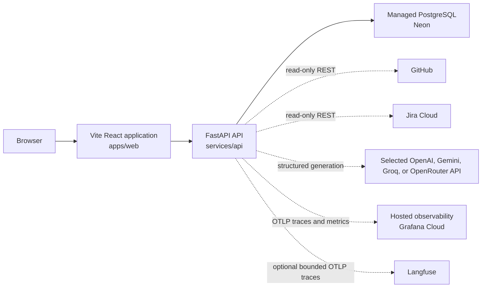

# Architecture

This document describes the system as it exists in the repository today
(Part 1), followed by forward-looking design notes for work that is not yet
implemented (Part 2), and closes with standing invariants, non-goals, and the
milestone sequence used to track progress (Part 3).

For how any given subsystem arrived at its current shape, see the relevant
ADR in [docs/decisions/](decisions/index.md) (e.g. [ADR-020](decisions/ADR-020-first-class-investigation-evidence.md)
for the evolution of the evidence model) rather than a narrative here.

---

# Part 1 — Current state

## System overview



Plain-text alternative:

```text
browser -> Vite React application -> FastAPI API -> Neon PostgreSQL
                                      `-> selected LLM provider (fake by default)
                                      `-> OTLP traces/metrics -> Grafana Cloud
                                      `-> optional bounded OTLP traces -> Langfuse
```

The frontend's root route (`/`) renders `InvestigationConsolePage`, which
submits an investigation request and navigates to `/runs/:runId` to poll the
persisted snapshot. `/runs/:runId` renders either an investigation dashboard
or a merge-readiness dashboard depending on the stored `workflow_name`, so a
merge-readiness run remains viewable if one already exists — but nothing in
the current routing lets a browser *start* one: `MergeReadinessPage.tsx` and
`RequestForm.tsx` still exist and have their own tests, but `App.tsx` never
imports them, so they are unreachable dead code in the running app. The API
also serves `GET /health`.

```text
GET  /v1/demo/pull-request-scenarios       -> selectable fixture metadata
POST /v1/pull-request-inspections          -> combined GitHub and Jira facts (fixture-only)
POST /v1/pull-request-merge-readiness      -> synchronous run, policy result, explanation, and facts
POST /v1/pull-request-merge-readiness-runs -> accepted pending run ID (202)
POST /v1/investigations                    -> accepted pending investigation run ID (202)
GET  /v1/runs/{run_id}                     -> persisted current run snapshot (merge-readiness or investigation)
GET  /health                               -> liveness check
```

Browser code calls relative `/v1` URLs. Vite proxies that prefix to the local
API during development; a production ingress or web server must provide the
same routing contract.

## Responsibilities

| Path | Current responsibility |
| --- | --- |
| `apps/web` | Browser UI for the investigation console (request submission, run polling, hypothesis/finding presentation) and a shared run dashboard that also renders a merge-readiness run's decision/evidence if one is opened directly by ID; a merge-readiness *submission* form exists in source but is not reachable from the app's routing |
| `services/api` | Backend HTTP boundary, independently selected fake/live GitHub and Jira connectors, merge-readiness and investigation workflow execution, PostgreSQL persistence, deterministic policy, planning/execution/hypothesis generation for investigations, and observability export |
| `packages` | Reserved for reusable TypeScript packages; not yet present |
| `docs` | Product, architecture, testing, decisions, and work records |
| `infra` | Reserved for future infrastructure configuration; not yet present |
| `scripts` | Reserved for future repository automation; not yet present |

## Module map

```text
services/api/app/
├── connectors/          # GitHub/Jira/incident provider access (fake + live)
├── tools/                # Typed, read-only investigation tool registry over connectors
├── inspection/           # Fixture-only raw GitHub+Jira lookup (legacy/demo route)
├── policy/                # Pure merge-readiness decision function
├── investigations/        # Investigation domain: facts, planning, execution, hypotheses
│   ├── code_diagnosis/    # Grounded code-location findings + recommendations
│   ├── fact_derivation/   # Evidence -> deterministic Fact derivation
│   ├── hypotheses/        # Hypothesis generation, validation, rendering
│   └── planning/          # Typed LLM planner + deterministic plan validation
├── explanations/           # Merge-readiness natural-language explanation generation
├── diagnostics/            # Standalone, explicitly-invoked provider-boundary CLIs
├── evals/                  # Offline quality/regression harness
│   └── investigations/     # Investigation-specific component/trajectory evals
├── runtime/                 # Run/step lifecycle, state machine, persistence contracts
├── database/                 # SQLAlchemy engine, ORM models, Postgres repository
├── observability/             # OpenTelemetry tracing/metrics/logging, Langfuse export
│   └── live_event_broker.py    # In-process per-run pub/sub feeding the live SSE tap
├── workflows/                  # Orchestrates connectors/policy/investigation into one run
├── api/v1/                      # FastAPI routes and HTTP-facing models
│   └── live_events_router.py     # GET /v1/runs/{run_id}/events - live SSE tap
└── main.py                       # Application assembly (DI wiring, lifespan, routes)
```

```text
apps/web/src/
├── routing.ts                          # Path -> page mapping (merge-readiness, investigation, run dashboard)
├── App.tsx                              # Top-level route switch
└── features/inspection/
    ├── types.ts                          # Shared TypeScript data shapes
    ├── requestValidation.ts               # Form input -> typed request
    ├── responseValidation.ts               # Untrusted network JSON -> typed union
    ├── investigationRequest.ts              # Investigation-specific request shaping
    ├── api.ts / investigationApi.test.ts     # Backend /v1 calls
    ├── apiError.ts                            # Client failure representation
    ├── runPolling.ts                           # Shared snapshot-polling loop
    ├── useRunSnapshot.ts                        # Polling hook used by both dashboards
    ├── liveEventStream.ts                        # Framework-free SSE controller (EventSource wrapper)
    ├── useRunLiveEvents.ts                        # Live-event hook wrapping liveEventStream.ts
    ├── MergeReadinessPage.tsx                    # Merge-readiness request form (unreachable — App.tsx never imports it)
    ├── RunDashboardPage.tsx                       # Live run dashboard; dispatches on workflow_name
    ├── InvestigationConsolePage.tsx                # Investigation request submission UI (the actual `/` route)
    ├── InvestigationDashboard.tsx                   # Live investigation run dashboard
    ├── InvestigationTraceView.tsx                   # /runs/{id}/trace - live SSE event list, additive to the dashboard
    └── components/
        ├── RequestForm.tsx                           # Merge-readiness request input form (used only by the unreachable page above)
        └── MergeReadinessPanel.tsx                    # Decision/evidence rendering, reused by RunDashboardPage for a merge-readiness run
```

Each `.test.ts`/`.test.tsx` file next to its module is a colocated unit test,
omitted above for brevity.

## Dependency and ownership boundaries

- Bun owns JavaScript/TypeScript dependencies and workspace scripts;
  `apps/web` owns its own React/Vite dependencies. No shared TypeScript
  package exists yet — introduce one only for a concrete cross-package need.
- uv owns dependencies declared in `services/api/pyproject.toml`;
  `services/api` does not use Bun for Python packages.
- `GET /v1/demo/pull-request-scenarios` and `POST /v1/pull-request-inspections`
  are fixture-only: `inspection/service.py` constructs `FakeGitHubConnector`
  and `FakeJiraConnector` directly and never reads connector-mode
  configuration. Every other route uses the application-selected connector.
- `POST /v1/pull-request-merge-readiness` and the live-run routes delegate to
  `MergeReadinessWorkflowService` / `InvestigationWorkflowService`; routes
  contain neither connector sequencing nor policy/planning logic
  (`api/v1/connector_router.py`).
- `app.policy.evaluate_merge_readiness` is a pure function: it accepts typed
  GitHub/Jira facts, performs no I/O, and returns every verified blocker plus
  explicit missing-information and evidence references
  (`policy/evaluator.py`). A blocker takes precedence over missing
  information, which takes precedence over `READY`.
- GitHub and Jira connector source (`fake` or live) are selected
  independently via `PROMPTQL_GITHUB_CONNECTOR` / `PROMPTQL_JIRA_CONNECTOR`;
  both default to `fake`, and neither live mode falls back to fixture data on
  failure (`config.py`, `connectors/factory.py`). `RunSources` persists the
  GitHub, Jira, and explanation source actually used by a run.
- `GitHubConnector` and `JiraConnector` are async protocols shared by fake
  and HTTP implementations (`connectors/protocols.py`); the workflow neither
  knows nor branches on which implementation it received. Raw provider JSON
  is validated and normalized inside `github_http.py` / `jira_http.py` /
  `github_code_http.py` before it becomes a domain value.
- `MergeReadinessWorkflowService` runs exactly three ordered steps —
  fetch GitHub facts, fetch Jira facts, evaluate policy — persisting a
  snapshot at each transition through the injected `RunRepository`
  (`workflows/merge_readiness.py`). A completed run carries `result`; a
  failed run returns HTTP `500` with a sanitized error and `result=null` on
  the synchronous route.
- `POST /v1/pull-request-merge-readiness-runs` and `POST /v1/investigations`
  are both additive, asynchronous: each first commits a pending snapshot,
  returns `202 Accepted` with the run ID, and continues the workflow in a
  process-local task owned by `LiveRunTaskRegistry`, which cancels
  outstanding tasks at app shutdown. This is not durable execution — a crash
  loses in-flight work, though already-committed PostgreSQL snapshots remain
  readable.
- `RunRepository` isolates workflow execution from storage; production route
  dependencies require `PostgresRunRepository`, wrapped by
  `ObservedRunRepository` for telemetry (`api/v1/connector_router.py`).
- One application-lifetime SQLAlchemy engine owns a 5-connection pool with a
  5-second timeout and pings/recycles connections
  (`database/engine.py`). Startup (`verify_database_ready`) fails fast if the
  `workflow_runs`/`workflow_steps`/`repository_fact_recurrence` tables or the
  `investigation_state` column are missing, rather than accepting requests it
  cannot persist. Alembic owns schema creation; the application never runs
  migrations or calls `create_all()`.
- `FactRecurrenceRepository` isolates the repository-scoped Fact-type
  recurrence counter (see
  [Repository-scoped Fact-type recurrence](#repository-scoped-fact-type-recurrence-currentimplemented-write-side-only))
  from storage the same way `RunRepository` does; production route
  dependencies require `PostgresFactRecurrenceRepository`
  (`api/v1/connector_router.py`).
- `GET /v1/runs/{run_id}` returns one persisted current snapshot and selects
  its typed response shape (`MergeReadinessResponse` vs
  `InvestigationResponse`) from the stored `workflow_name`, so both workflow
  kinds share one polling resource without client-side inference
  (`api/v1/connector_router.py`).
- OpenTelemetry traces and metrics export via OTLP HTTP/protobuf only when
  `PROMPTQL_TELEMETRY_ENABLED=true` and an endpoint or console exporter is
  configured; a separately gated Langfuse OTLP traces-only exporter can share
  the same tracer provider (`observability/setup.py`). Both exporters are
  wrapped by a failure-isolating decorator, so a setup or export failure logs
  one bounded warning and never changes HTTP, runtime, policy, or persistence
  behavior. `run_id` may correlate spans and logs; user-controlled values are
  never metric labels.
- Frontend network responses remain `unknown` until `responseValidation.ts`
  proves the expected discriminated snapshot shape (`pending` / `running` /
  `completed` / `failed` / `cancelled`) before rendering.

## Connectors subsystem

`connectors/` (`services/api/app/connectors/`) provides normalized,
provider-neutral access to GitHub, Jira, and incident/operational data behind
three async protocols in `protocols.py`: `GitHubConnector`, `JiraConnector`,
and `GitHubCodeEvidenceSource`/`IncidentSource` for investigation evidence.

- `factory.py` selects fake or HTTP implementations from `GitHubSettings` /
  `JiraSettings` mode (`config.py`); neither live mode falls back to fixture
  data on failure, and both default to `fake`.
- `github_http.py` / `jira_http.py` / `github_code_http.py` validate raw
  provider JSON against private strict response models before it becomes a
  domain value; `github_diff.py` parses unified-diff patch text into typed
  hunk evidence. The GitHub files-list call pages at 100 records with a
  10-page local maximum — a complete empty response yields no evidence,
  reaching the bound raises `GitHubIncompleteResultError`, and malformed
  JSON/schema/patch syntax raises `GitHubInvalidResponseError`.
- `IncidentSource` currently has only one implementation:
  `FakeIncidentSource` (`incident_fakes.py`), whose fixed fixtures back
  `get_incident_evidence`, `get_deployment_evidence`,
  `get_failure_location_evidence`, and `get_telemetry_window_evidence`. No
  HTTP/live incident source exists, and nothing in `config.py` or
  `main.py` selects one — `InvestigationWorkflowService` always falls back
  to `FakeIncidentSource()` unless a caller passes a different
  implementation explicitly (`workflows/investigation.py`), so investigation
  incident/deployment/telemetry evidence is fake-only today regardless of
  the configured GitHub/Jira connector mode.
- A lookup with no matching fixture raises `FixtureNotFoundError` rather than
  returning empty evidence, preserving the distinction between "unavailable"
  and "observed zero results."
- Jira's standard status model has no universal blocker field, so
  `blocker_state` is `UNKNOWN` unless a request explicitly encodes
  `BLOCKED`; only `BLOCKED` produces a policy blocker. GitHub's `mergeable`
  field is nullable and normalizes to `Mergeability.UNKNOWN` rather than a
  guessed true/false.

See [ADR-006](decisions/ADR-006-read-only-github-rest-connector.md), [ADR-007](decisions/ADR-007-read-only-jira-cloud-connector.md)/[ADR-008](decisions/ADR-008-optional-jira-blocker-evidence.md), and [ADR-021](decisions/ADR-021-focused-github-code-evidence-source.md) for how the GitHub/Jira connectors and the GitHub code-evidence source were introduced; see [Evidence & Fact model](#evidence--fact-model) below for the normalized `Evidence` envelope's current shape (its own history is [ADR-020](decisions/ADR-020-first-class-investigation-evidence.md)).

## Tools subsystem

`tools/` (`services/api/app/tools/`) exposes connector/source capabilities as
a small, typed, read-only surface that a planner or deterministic caller can
select from without seeing provider-specific APIs.

`ToolDefinition` pairs a stable `InvestigationToolId` with a typed strict
input model, a `ToolResult` output model, a `plan_output_model` (the static
contract a planner may reference from another step), and a `read_only` flag.
`ToolRegistry` stores these definitions — register (rejecting duplicate IDs),
`get` (raising `UnknownToolError`), and `list` (sorted, stable order) — and
never invokes a handler itself; `adapters.py` holds the actual call-through to
each connector/source.

`TOOL_DEFINITIONS` currently registers **eight** tools:

```text
get_commit            -> GitHubCodeEvidenceSource.get_commit_evidence
get_pull_request       -> GitHubCodeEvidenceSource.get_pull_request_evidence
get_diff                -> GitHubCodeEvidenceSource.get_changed_file_evidence
get_incident              -> IncidentSource.get_incident_evidence
get_deployments             -> IncidentSource.get_deployment_evidence
get_failure_location          -> IncidentSource.get_failure_location_evidence
query_telemetry                  -> IncidentSource.get_telemetry_window_evidence
get_jira_issue                      -> JiraConnector.get_issue + Jira Evidence normalization
```

A call flows: `ToolDefinition.validate_arguments` (invalid arguments raise
before any source call) → the adapter → the underlying
connector/source → a `ToolResult` with outcome `observed` / `empty` /
`failed`. `ToolFailure.code` is a closed `ToolFailureCode` enum; only
`rate_limited`, `timeout`, and `upstream_unavailable` are retryable
(`ToolFailure.retryable`) — authentication, authorization, invalid
request/response, missing resource, incomplete result, configuration, and
generic `source_failure` are terminal. Tool results carry typed `Evidence`
only; raw provider payloads, SDK objects, and credentials never cross this
boundary.

This registry is PromptQL-internal metadata; it is not MCP and has no
external transport.

## Runtime subsystem: run lifecycle and single-round execution

`runtime/` (`services/api/app/runtime/`) defines the shared run/step
lifecycle used by both workflow kinds: `RunStatus` and `StepStatus`
(`pending` / `running` / `completed` / `failed` / `cancelled`), state-machine
validators, and the `RunRepository` protocol. `CANCELLED` is a defined state
with model-level invariants, but no code path in the repository ever
transitions a run to it — see [Cancellation](#cancellation) in Part 2.

Investigation plan execution (`investigations/execution.py`) is a separate,
deterministic interpreter, `AgentExecutor`, that runs one already-validated
plan:

```text
ValidatedPlan (topologically ordered steps)
  -> for each step: dependency/output readiness check
  -> typed argument construction (ToolDefinition.validate_arguments)
  -> reserve one ExecutionBudget unit -> invoke adapter
  -> merge returned Evidence -> recompute Facts over the full accumulated set
  -> continue / retry / block remaining steps
```

- `ExecutionBudget.max_tool_calls` (0–100) is consumed immediately before
  every physical attempt, including retries — an attempted-and-failed call
  consumes budget, a step that is never invoked (`blocked`) does not.
  Exhaustion blocks every remaining pending step with reason
  `budget_exhausted` and preserves prior Evidence/Facts/failures.
- `RetryPolicy` allows at most 3 total attempts per step, with 1s then 2s
  delays (`initial_backoff_seconds=1.0`, `backoff_multiplier=2.0`). A retry
  is attempted only when the typed failure is `retryable` **and** attempts
  remain **and** budget remains; retries are owned by `AgentExecutor`, not by
  individual adapters, and every tool is currently `read_only`, so a retried
  call cannot duplicate a write effect (no idempotency system exists because
  no write tool exists yet).
- `failed` means a tool call was attempted and returned a typed failure;
  `blocked` means it was never invoked because a dependency failed or a
  referenced runtime output was unavailable. A failed branch blocks its
  descendants; an independent ready branch continues.

Execution is process-local and non-durable: `InvestigationExecutionState` and
`AdaptiveInvestigationState` (see [Planning subsystem](#planning-subsystem-planner-validator-and-replanning)) live only in memory during one
request; a crash mid-run loses that state. See
[Crash recovery](#crash-recoverycheckpointresume-design) in Part 2.

See [ADR-023](decisions/ADR-023-bounded-tool-retry-policy.md) for the retry/budget policy decision.

## Planning subsystem: planner, validator, and replanning

`investigations/planning/` turns accumulated investigation state into a
validated, executable plan, and `investigations/replanning.py` repeats that
cycle across bounded rounds.

**`TypedLLMPlanner`** (`planning/service.py`) sends a compact `PlannerInput`
— deterministic Facts, MissingInformation, evidence summaries, action
history, and the caller-approved subset of tool definitions (with their
input/output JSON Schemas) — through the injected `TypedLLMClient` and
parses only a bounded `InvestigationPlan`. It distinguishes provider failure,
an invalid outer structured response, and a plan that fails its own Pydantic
schema (`PlannerFailureCode.PROVIDER_FAILURE` / `INVALID_RESPONSE` /
`PLAN_SCHEMA_INVALID`). The standalone plan contract allows 1–5 steps
(`MAX_PLAN_STEPS = 5`); the current planner prompt (`investigation-planner`
/ `v2.7.6`) asks for 1–3 so live output fits the adaptive runtime's shorter
horizon. The planner never calls a tool adapter or emits a hypothesis field.

**`PlanValidator`** (`planning/validation.py`) is a pure function from an
untrusted `InvestigationPlan` + allowed tools to either a `ValidatedPlan` or
a list of typed `PlanValidationFailure`s. It checks, in order: step-count
bound, duplicate step IDs, unknown/not-allowed tools, unknown/self
dependencies, cycles (Kahn's-algorithm topological sort — an unresolved
remainder means a cycle), missing required arguments, unknown arguments,
literal-argument type compatibility, and — for a `StepOutputRef` — that the
referenced step is both an existing dependency and exposes that field on its
`plan_output_model` with a compatible type. Any failure rejects the whole
plan atomically.

**`AdaptiveInvestigationRuntime`** (`replanning.py`) is the live execution
path used by `InvestigationWorkflowService`. It runs up to
`MAX_PLANNING_ROUNDS = 3` rounds of plan → validate → execute
(`MAX_ADAPTIVE_PLAN_STEPS = 3` per round), accumulating Evidence, Facts,
MissingInformation, and a compact `ActionSummary` history across rounds. At
each round boundary it compares evidence/fact ID sets before and after
execution; the delta is a progress signal only, never an importance score.
The runtime stops (`ContinuationReason`) on: exhausted global tool-call
budget, 3 completed rounds, one no-progress round
(`MAX_NO_PROGRESS_ROUNDS = 1`), planner failure, or plan-validation failure.
It never inspects the semantic content of an Evidence or Fact item.

No dedicated ADR covers the tool registry, deterministic baseline, planner,
plan validator, execution loop, or round-based replanning individually —
these were built incrementally under the V2.5–V2.16 milestones tracked in
[Part 3's implementation sequence](#implementation-sequence) rather than each
getting a separate decision record. [ADR-023](decisions/ADR-023-bounded-tool-retry-policy.md) covers the retry policy specifically.

## Investigations subsystem structure

`investigations/` (`services/api/app/investigations/`) is the domain package
for the incident-investigation workflow. It has grown well beyond the single
`models.py` file from its first milestone into six areas:

```text
investigations/
├── models.py           # Evidence, Fact, Hypothesis, MissingInformation, RecommendedAction, InvestigationRequest/Result
├── baseline.py           # DeterministicBaseline: fixed-sequence runbook (not the live path)
├── execution.py            # AgentExecutor: single-round plan interpreter, budgets, retries
├── replanning.py             # AdaptiveInvestigationRuntime: multi-round planner/validator/executor loop (the live path)
├── fact_derivation/            # Pure Evidence -> Fact relationship rules
│   ├── code_change.py            # ChangedFileFact, changed-file/failure-file/hunk matching
│   ├── deployment.py               # Deployment-to-commit, commit-to-PR association
│   └── temporal.py                   # Deployment-preceded-incident ordering
├── relationship_index.py               # In-process entity graph over Facts (no storage): find_connecting_facts()
├── planning/                           # TypedLLMPlanner + PlanValidator (see Planning subsystem above)
├── hypotheses/                           # Hypothesis generation, deterministic validation, rendering
└── code_diagnosis/                         # Code-location findings + developer recommendations
```

**How a live investigation actually flows** (`workflows/investigation.py`,
`InvestigationWorkflowService`):

```text
InvestigationRequest
  -> AdaptiveInvestigationRuntime.investigate()          [planning/ + replanning.py]
       (up to 3 rounds of plan -> validate -> AgentExecutor.execute())
  -> accumulated Evidence -> derive_facts()                [fact_derivation/]
  -> TypedLLMHypothesisGenerator.generate() (only if Facts exist)
  -> DeterministicHypothesisValidator.validate()             [hypotheses/]
  -> CodeContextBuilder.build() (only if a hypothesis validated)
  -> TypedLLMCodeDiagnoser.generate()
  -> DeterministicCodeFindingValidator.validate()              [code_diagnosis/]
  -> render_grounded_result()                                    [hypotheses/rendering.py]
       (builds a per-render build_relationship_index(facts) and attaches
        find_connecting_facts() chains to hypotheses with a clean entity pair)
                                                                       [relationship_index.py]
  -> GroundedInvestigationResult persisted as InvestigationRun.result
```

Each stage is independently optional-on-failure: a failed planner, hypothesis
generator, or code diagnoser stops that stage and records a distinct
`GroundedTerminationReason` (`planner_failure`, `hypothesis_generation_failure`,
`code_diagnosis_failure`, ...) while preserving whatever Evidence/Facts/
hypotheses were already validated — a code-diagnosis failure, for example,
still returns the grounded hypothesis from the stage before it.

Two models are easy to conflate:

- **`InvestigationResult`** (`models.py`) is the original V2.1 domain
  container (evidence + facts + hypotheses + missing information +
  recommended actions, with full cross-reference validation). It is used by
  `baseline.py`'s `DeterministicBaseline` runbook and by
  `diagnostics/openrouter.py`'s standalone CLI — **not** by the live
  investigation route.
- **`GroundedInvestigationResult`** (`hypotheses/rendering.py`) is what the
  live route actually persists and returns: a compact, already-rendered
  result (`termination_reason`, `summary`, `supported_hypotheses`,
  `code_findings`, `recommendations`, `key_fact_ids`, `missing_information`)
  produced only by `render_grounded_result()` from validated structures. Each
  `GroundedHypothesis` also carries an optional `connected_fact_chain`: the
  ordered Facts a BFS traversal (`relationship_index.find_connecting_facts()`)
  found between the two entities the hypothesis's own cited Facts identify,
  restricted to relationship kinds actually relevant to that hypothesis's
  causal story (`_HYPOTHESIS_RELEVANT_RELATIONSHIPS`) so an incidental edge
  (e.g. which PR a changed file came from) can't block or distort a chain
  the hypothesis isn't actually about. It is `None` whenever the relevant
  Facts don't name exactly two distinct entities — additive detail alongside
  the existing flat `supporting_fact_ids`, never a replacement for it.

`relationship_index.py` re-derives, in process and per render call, an
explicit entity graph from typed fields six Fact types carry. Five always
name two entities; `ChangedFileFact` produces a sixth edge
(`FILE -> PULL_REQUEST`, kind `changed_in_pull_request`) only when its
(nullable) `pull_request_number` is present — which it is whenever the Fact
was derived from GitHub evidence for a pull request, since
`fact_derivation/code_change.py` now preserves that field instead of
dropping it. It adds no storage, no dependency, and no new derived Fact.
Its scope is deliberately narrow: it answers "what Facts connect entity A
to entity B," not "what depends on service X" — no Fact ties a `service`
string (deployment/incident evidence) to a repository or file (GitHub
evidence), so building that mapping would assert a relationship the
collected Facts don't support. For the checkout-500 fixture, the
`FILE -> PULL_REQUEST` edge closes what used to be two disconnected
subgraphs: `find_connecting_facts()` between a `DEPLOYMENT` entity and a
`FAILURE_LOCATION` entity now returns the full chain
`deployment_references_commit -> commit_associated_with_pull_request ->
changed_file -> changed_file_matches_failure_file`.

`InvestigationRuntimeSnapshot` (`runtime/investigation_models.py`) is the
third, JSON-persisted shape: it carries per-round planner/execution detail
(`InvestigationPlanningRoundSnapshot`, `InvestigationStepSnapshot`) plus the
accumulated Evidence/Facts/MissingInformation/action history, and is what
`GET /v1/runs/{run_id}` actually returns while a run is `pending`/`running`,
with the final `GroundedInvestigationResult` in its `result` field once
`completed`.

## Evidence & Fact model

`Evidence` (`investigations/models.py`) is an immutable, provider-neutral
envelope: `evidence_id`, `source` (`github` / `jira` / `incident` /
`deployment` / `telemetry`), `kind`, `provenance`
(`source_reference`, optional `observed_at`, required `retrieved_at`, both
timezone-aware), and a discriminated `content` union. Nine content variants
exist today: `changed_file`, `commit`, `pull_request`, `diff_hunk`,
`jira_issue`, `incident`, `stack_frame`, `deployment`, and
`telemetry_window`. A model validator enforces that `kind` matches
`content.content_type` and that the declared `source` is the one expected
for that `kind` (e.g. `stack_frame` must come from `incident`).

`derive_facts()` (`fact_derivation/`) is a pure function, re-run over the
full accumulated Evidence set after every new observation, that joins
Evidence into eight typed relationship facts by three independent rule
modules:

- **`code_change.py`**: emits a `ChangedFileFact` per observed changed file;
  `ChangedFileMatchesFailureFileFact` when a changed file's normalized path
  equals a stack frame's file path; `ChangedHunkOverlapsFailureLineFact`
  when a diff hunk's new-line range contains the frame's line number (a
  pure-deletion hunk, `new_count == 0`, can never match).
- **`deployment.py`**: `DeploymentReferencesCommitFact` when a deployment's
  commit SHA case-insensitively matches an observed commit;
  `CommitAssociatedWithPullRequestFact` when that commit SHA matches a pull
  request's head or merge SHA.
- **`temporal.py`**: `DeploymentPrecededIncidentFact` only under strict
  inequality (`deployed_at < incident.started_at`) — equal timestamps
  produce no fact, and the fact name is deliberately "preceded," not
  "caused."

Every fact carries `evidence_reference_ids` back to the Evidence that
established it; `InvestigationResult` (where used) rejects any fact,
hypothesis, or action whose references don't resolve. **Groundedness is not
correctness**: the deterministic validators described in
[Hypotheses subsystem](#hypotheses-subsystem) below classify a hypothesis as
`supported` / `weakly_supported` / `contradicted` / `unsupported` /
`unknown` relative to *current Evidence*, which is a claim about available
support — not an objective determination of the true root cause. A
"supported" hypothesis can still be wrong; the correct root cause can only
come from an offline golden case, engineer confirmation, or later
operational evidence, none of which the validator consults.

### Repository-scoped Fact-type recurrence (CURRENT/IMPLEMENTED, write side only)

`repository_fact_recurrence` (`database/models.py`,
`RepositoryFactRecurrenceRow`) is a durable PostgreSQL counter keyed by the
composite `(repository_owner, repository_name, fact_type)`, independent of
any single run. At the end of `InvestigationWorkflowService._complete_adaptive_run`
(`workflows/investigation.py`), for every distinct `fact_type` present in the
final `FactSet` (deduplicated so one run counts at most once per type), the
injected `FactRecurrenceRepository` deterministically increments
`occurrence_count` and sets `promoted_at` the first time the count reaches
`FACT_RECURRENCE_PROMOTION_THRESHOLD = 3`. It is **not** an `InvestigationFact`
subclass: it aggregates evidence-backed conclusions across runs and cannot
carry one run's `evidence_reference_ids`, so representing it as a Fact would
misstate its provenance. A write failure is reported through existing
diagnostic telemetry and does not fail an otherwise-successful run, since the
counter is a side channel outside `GroundedInvestigationResult`.

This is a write path only. Nothing today reads `repository_fact_recurrence`
back into `ContextBuilder.build()` or any prompt — see
[ADR-031](decisions/ADR-031-repository-scoped-fact-recurrence-memory.md) for
the full reasoning, including why exact-Fact-instance recurrence (as opposed
to Fact-*type* recurrence) can never fire, and why the richer LLM-proposed
memory shape (naming aliases, narrative root-cause patterns) is deliberately
deferred as its own future decision.

## Hypotheses subsystem

`investigations/hypotheses/` generates, validates, and renders causal
hypotheses about why an incident happened, without ever letting generated
prose become final output.

- **`TypedLLMHypothesisGenerator`** (`service.py`) sends Facts,
  MissingInformation, and the investigation goal through the injected
  `TypedLLMClient` and parses only `CandidateHypothesis` values — untrusted,
  provider-proposed causal claims. Called only when at least one Fact
  exists; an empty Fact set skips the provider call entirely rather than
  asking a model to hypothesize from nothing.
- **`DeterministicHypothesisValidator`** (`validator.py`) accepts a
  candidate only if its `kind` is the currently supported
  `CODE_CHANGE_MAY_HAVE_CONTRIBUTED` family, its supporting-fact references
  are unique and all resolve, and the selected Facts jointly establish both
  a `ChangedFileFact` **and** a matching `ChangedFileMatchesFailureFileFact`
  / `ChangedHunkOverlapsFailureLineFact` for the same file-path subject.
  Everything else is rejected with a specific `HypothesisValidationFailureCode`
  (`unsupported_hypothesis_kind`, `entity_mismatch`,
  `missing_required_support`, ...). No dependency-failure, deployment-only,
  or provider-specific hypothesis kind exists yet — the Fact vocabulary
  doesn't support one.
- **`render_grounded_result()`** (`rendering.py`) accepts only
  `ValidatedHypothesis` values, re-resolves every supporting Fact ID against
  the current FactSet (raising `GroundingRenderError` if one is missing),
  and emits a `GroundedInvestigationResult` from **fixed templates** — the
  candidate's generated rationale text never reaches this function or the
  final result. The rendered summary also keeps termination reasons
  (budget exhaustion, no progress, planning-round limit, planner/hypothesis/
  code-diagnosis provider failure, plan-validation failure) semantically
  distinct from each other and from a runtime crash.

See [ADR-024](decisions/ADR-024-grounded-hypothesis-proposals.md) for this generation/validation boundary's origin.

## Code diagnosis subsystem

`investigations/code_diagnosis/` is a second, narrower probabilistic stage
that runs only after a hypothesis has already been validated: it proposes
*where in the code* a validated hypothesis's change likely matters, and
turns that into a read-only developer recommendation.

- **`CodeContextBuilder`** (`context.py`) builds the minimized
  `CodeDiagnosisInput`: only Evidence whose file path matches an accepted
  hypothesis's subject, capped at `MAX_CODE_CONTEXT_LOCATIONS` locations and
  `MAX_CODE_LINES_PER_HUNK` lines per hunk (each line further truncated to
  300 characters). Precomputed `CodeDiagnosisSupport` bundles give the model
  the exact Fact-to-Evidence relationship so it doesn't have to (and can't
  authoritatively) reconstruct it.
- **`TypedLLMCodeDiagnoser`** (`service.py`) asks the model to select a
  `location_evidence_id` from that bounded context plus a finding
  `category` — the candidate cannot emit a numeric line, file path, or
  function name of its own.
- **`DeterministicCodeFindingValidator`** (`validator.py`) resolves the
  candidate's exact coordinates (line number, function name, or hunk
  identity) *from the referenced Evidence itself*, not from anything the
  candidate said, and rejects a candidate whose supporting facts/evidence
  don't exactly match the originating hypothesis's own support bundle, or
  whose file path doesn't match a `ChangedFileEvidenceContent` **and** a
  `StackFrameEvidenceContent` observed at that same normalized path.
- **`build_developer_recommendations()`** (`remediation.py`) turns each
  `ValidatedCodeFinding` into a backend-owned template recommendation;
  `render_grounded_result()` cross-checks that a recommendation's supporting
  fact/evidence IDs exactly match its originating finding before including
  it.

A code-diagnosis provider or schema failure (`CodeDiagnosisError`) preserves
the already-grounded hypothesis, records termination reason
`code_diagnosis_failure`, and exposes no candidate payload — this is a
partial-success result, not a run failure.

See [ADR-026](decisions/ADR-026-budgeted-failure-location-evidence.md) and [ADR-027](decisions/ADR-027-evidence-identified-code-diagnosis.md) for this boundary's origin.

## Diagnostics subsystem

`diagnostics/` (`services/api/app/diagnostics/`) holds standalone,
explicitly-invoked developer CLIs — not application code. `__init__.py`
documents that the package has no import-time side effects, so `main.py`
never imports it and it plays no role in serving requests.

**`openrouter.py`** (774 lines) is a secret-safe diagnostic for the
OpenRouter provider boundary specifically — the same
`https://openrouter.ai/api/v1` OpenAI-compatible endpoint the `explanations/`
and investigation task clients use in production. Run as a script
(`--stage <name>`), it probes eight increasingly specific stages, each
requiring `PROMPTQL_LLM_PROVIDER=openrouter`:

```text
config            -> resolved provider/model routing only, no network call
plain             -> a bare chat.completions.create() round trip
typed             -> generate_typed() against a tiny smoke schema
planner           -> a real TypedLLMPlanner.plan() call
planner-routing   -> a raw parse() call with extra_body={"provider": {"require_parameters": True}}
hypothesis        -> a real TypedLLMHypothesisGenerator.generate() call
code-diagnosis    -> the full Evidence -> Fact -> validated-hypothesis -> code-finding path
workflow          -> a complete InvestigationWorkflowService run (in-memory repo, fake connectors)
```

Any stage beyond `config` can make a real, billed OpenRouter call and
requires an explicit `--acknowledge-paid-call` flag; `all` runs the
component stages in order and stops at the first failure ("fail-fast", since
a later stage can't explain an earlier boundary failure). Every result is
built through `_failure_result()` / `_sanitize_message()`, which redact the
API key, any `Bearer <token>` header, and any `sk-...`-shaped key from
provider error text, and truncate messages to 500 characters — only a fixed
allowlist of fields (HTTP status, provider error code/type, sanitized
message, upstream provider name) is ever printed. `resolved_configuration()`
reports which models/routes are active without ever including the key
itself.

This exists because OpenRouter failures can originate at several different
layers — raw transport/auth, this project's typed-parsing adapter, the
planner's schema, or OpenRouter's own upstream-provider routing — and the
staged design lets a developer isolate which layer is failing without
guessing from a single opaque error.

## Evals subsystem

`evals/` (`services/api/app/evals/`) is an offline, manually-invoked quality
harness that reuses production code paths without going through FastAPI or
persistence. It has two independent datasets:

**V1 explanation evals** (`evals/`, dataset IDs `merge-readiness-development-v1`
and `merge-readiness-holdout-v1`, both `v1`): 11 development cases (8 direct
fixture scenarios plus 3 constructed edge cases —
`unknown-mergeability`, `draft-and-merge-conflict`,
`multiple-blockers-and-actions`) and 6 holdout cases
(`cases.py`). `runner.py` defaults to 3 serial samples per case with a
1-second inter-call delay; `graders.py` keeps every attempt in
provider/attempt denominators but only returned candidates in
model-quality denominators, and `reporting.py` writes JSONL observations
incrementally to ignored `local-artifacts/` plus a final typed JSON report.
Expected claims always come from the real pure policy function
(`required_explanation_claims()`), never a hand-written expectation.

**V2 investigation evals** (`evals/investigations/`, dataset ID
`v2-investigation-{split}`): evaluate both individual components and the
complete adaptive trajectory —

```text
planner validity and useful tool coverage
deterministic Fact derivation and Evidence grounding
hypothesis generation, reference agreement, deterministic validation
code diagnosis, Evidence-identified location grounding, reference agreement
deterministic recommendation grounding and reference agreement
adversarial unsupported-claim rejection
the complete production adaptive trajectory with fake connectors
```

`MAX_PROVIDER_CALLS_PER_SAMPLE = 3 + MAX_PLANNING_ROUNDS + 2 = 8` bounds the
worst-case provider spend per sample; `DEFAULT_SAMPLES_PER_CASE = 3`. A
preflight reports the maximum possible provider calls before any real run,
and a real (non-`fake`-provider) run requires explicit acknowledgement of
paid calls. Denominators for provider success, schema validity, grounding
quality, and ground-truth correctness are kept separate rather than
collapsed into one "accuracy" number, so a failed provider/schema call is a
release failure without becoming a misleading reasoning-quality zero.

Both harnesses omit prompts, generated prose, connector payloads, repository/
Jira identity, credentials, raw provider responses, and exception text from
every artifact.

See [ADR-015](decisions/ADR-015-versioned-explanation-eval-harness.md) for the V1 harness and [ADR-029](decisions/ADR-029-versioned-investigation-component-trajectory-evals.md) for the V2 harness.

## Observability subsystem

`observability/` (`services/api/app/observability/`) provides one
OpenTelemetry tracer/meter provider shared by the merge-readiness workflow,
the investigation runtime, and FastAPI request instrumentation
(`FastAPIInstrumentor`, with `/health` excluded).

- `RuntimeTelemetry` (`runtime_telemetry.py`) exposes both the V1
  workflow-span API (`observe_workflow`, `observe_step`,
  `record_terminal_step`/`record_terminal_workflow`) and the investigation
  API `observe_investigation_stage()`, parameterized by a closed
  `InvestigationStage` enum: `investigation`, `planning_round`, `planner`,
  `plan_validation`, `tool_execution`, `retry`, `fact_derivation`,
  `hypothesis_generation`, `hypothesis_validation`, `code_diagnosis`,
  `code_validation`, `render`, `termination`. Stage outcomes
  (`InvestigationStageResult`: `succeeded` / `failed` / `rejected` /
  `blocked`) and a closed `FailureCategory` enum (connector, policy,
  persistence, LLM-provider, LLM-invalid-output, LLM-validation, system,
  telemetry-export, ...) keep span/metric labels bounded and free of
  user-controlled or provider-controlled text.
- `ObservedRunRepository` (`observed_run_repository.py`) wraps
  `PostgresRunRepository` to add persistence-checkpoint spans without the
  workflow code depending on telemetry directly.
- `structured_logging.py` emits safe, correlated JSON events (e.g.
  `runtime.connector_sources.selected`, `runtime.telemetry.export_failed`);
  `run_id` may correlate spans/logs but is never a metric label.
- `create_observability()` / `setup.py` builds the tracer/meter provider only
  when `PROMPTQL_TELEMETRY_ENABLED=true` (console and/or OTLP export) or
  `PROMPTQL_LANGFUSE_ENABLED=true`; otherwise it returns a no-op provider.
  When Langfuse is enabled, a second `BatchSpanProcessor` sends the same
  bounded spans to `{LANGFUSE_BASE_URL}/api/public/otel/v1/traces` — fan-out
  from one tracer provider, not a parallel event or decision system.
  `FailureIsolatingSpanExporter` / `FailureIsolatingMetricExporter` wrap
  every exporter (console, general OTLP, and Langfuse) so an export or
  shutdown failure logs one bounded warning and disables only that exporter,
  never HTTP/runtime/policy/persistence behavior.
- Investigation generation spans record task, provider, requested and
  provider-resolved model, prompt version, and provider-reported token
  counts, using both PromptQL-specific attributes and standard `gen_ai.*` /
  `langfuse.observation.*` attribute names so Langfuse can interpret usage.
  Unknown token usage or price stays unknown; no cost is invented locally.

See [ADR-005](decisions/ADR-005-opentelemetry-observability.md) for the original OpenTelemetry/Grafana design and [ADR-028](decisions/ADR-028-passive-langfuse-otlp-generation-tracing.md) for the Langfuse export.

## Explanations subsystem and provider boundary

`explanations/` (`services/api/app/explanations/`) generates the
non-authoritative natural-language explanation attached to a completed
merge-readiness response, and also supplies the shared `TypedLLMClient`
protocol/adapters that the investigation planner, hypothesis generator, and
code diagnoser reuse.

`MergeReadinessExplanationService` minimizes a completed
`MergeReadinessResult` to stable decision/reason/action codes before calling
an injected `LLMClient`; the generated `GeneratedExplanation` is untrusted
until `StrictMergeReadinessExplanationValidator` confirms its codes exactly
cover the policy's required set (no inventions, omissions, duplicates, or
contradictions), after which backend-owned templates (`templates.py`) render
the only wording ever shown — generated prose itself is discarded.
Explanations are not persisted, so each POST/GET can trigger a fresh
provider call in a real-provider mode.

`create_llm_client()` (`factory.py`) is the sole production selection point,
driven by `LLMSettings.from_environment()` (`config.py`):

```text
PROMPTQL_LLM_PROVIDER=fake        -> FakeLLMClient (default)
PROMPTQL_LLM_PROVIDER=openai      -> AsyncOpenAI()                                    -> OpenAILLMClient
PROMPTQL_LLM_PROVIDER=gemini      -> AsyncOpenAI(base_url=generativelanguage .../openai/) -> GeminiLLMClient
PROMPTQL_LLM_PROVIDER=groq        -> AsyncOpenAI(base_url=api.groq.com/openai/v1)         -> GroqLLMClient
PROMPTQL_LLM_PROVIDER=openrouter  -> AsyncOpenAI(base_url=openrouter.ai/api/v1)            -> OpenRouterLLMClient(GroqLLMClient)
```

All four non-fake compatibility URLs are fixed in the factory (environment
configuration cannot redirect a provider's secret to an arbitrary host); the
SDK is always constructed with `max_retries=0`, so runtime retry policy is
never silently amplified by the SDK. `OpenRouterLLMClient` is a thin
subclass of `GroqLLMClient` that swaps the provider identity and disables
Groq's reasoning-effort request parameter (`_typed_reasoning_effort = None`)
rather than duplicating the adapter.

For investigations, `ModelPolicy.model_for(task)` (`config.py`) resolves
`PROMPTQL_PLANNER_MODEL` / `PROMPTQL_HYPOTHESIS_MODEL` /
`PROMPTQL_CODE_DIAGNOSIS_MODEL`, each falling back to
`PROMPTQL_DEFAULT_MODEL`; for a non-fake provider, startup
(`LLMSettings.from_environment()`) requires either the default model or all
three task models to be set, so a missing model fails at boot rather than
mid-investigation. `main.py`'s `create_app()` constructs one client per task
(`investigation_planner_client`, `investigation_hypothesis_client`,
`investigation_code_diagnosis_client`) plus the shared V1 explanation client
— PromptQL owns this deterministic task-to-model mapping; OpenRouter owns
whatever serving-provider routing happens behind its endpoint. No semantic
or quality-based model routing is performed.

Provider-specific adapter behavior that still holds:

- **Gemini**'s OpenAI-compatibility layer rejects the full
  `GeneratedExplanation` JSON Schema (its enum/length constraints produce
  too many serving states), so `GeminiStructuredClaims` asks for a decision
  plus integer indexes into request-specific allowed reason/action lists;
  the adapter rejects duplicate/out-of-range indexes before mapping back to
  real codes. `GeminiLLMClient` also recognizes Google's HTTP 400
  `INVALID_ARGUMENT` invalid-key shape and normalizes it to the standard
  `authentication` failure category.
- **Groq** receives `GeneratedExplanation` as a Pydantic response format
  that the OpenAI SDK converts to a strict JSON Schema; Groq's strict-mode
  support is currently limited to `openai/gpt-oss-20b` and
  `openai/gpt-oss-120b`. The parsed object is still revalidated and
  semantically grounded exactly as for any other provider.
- **OpenRouter** reuses the Groq adapter unchanged apart from provider
  identity and the omitted reasoning-effort parameter.

See [ADR-012](decisions/ADR-012-openai-structured-explanation-adapter.md) (OpenAI), [ADR-013](decisions/ADR-013-gemini-openai-compatible-explanation-adapter.md)/[ADR-014](decisions/ADR-014-gemini-compact-claim-indexes.md) (Gemini), [ADR-017](decisions/ADR-017-groq-openai-compatible-explanation-adapter.md) (Groq), and [ADR-030](decisions/ADR-030-openrouter-openai-compatible-explanation-adapter.md) (OpenRouter) for each adapter's introduction, and [ADR-011](decisions/ADR-011-grounded-explanation-code-validation.md) for the grounding/validation boundary.

## Live run dashboard

`GET /v1/runs/{run_id}` returns the persisted current workflow snapshot — not
an event stream. `RunPollingController` (`runPolling.ts`, shared by
`useRunSnapshot.ts` for both dashboard variants) issues one GET roughly every
1000ms while the snapshot is `pending` or `running`, stops automatically once
it reaches a terminal status (`completed` / `failed` / `cancelled`), and
aborts its in-flight request on unmount or route change. A transient refresh
failure surfaces as a dashboard notice and is retried on the same interval;
it never mutates the backend-owned status shown to the user.

```text
browser POST /v1/investigations (or a merge-readiness live-start)
  -> PostgreSQL pending snapshot -> 202 {run_id, pending}
browser navigate /runs/:runId -> repeated GET snapshot -> validated dashboard
in-process task -> workflow/runtime transitions -> PostgreSQL current snapshot
```

Opening `/runs/:runId` directly (including after a browser refresh, or for a
run never started from this browser) works because critical run state lives
in PostgreSQL, not React memory — `App.tsx` derives the page purely from the
URL path. Vite's dev server supplies the SPA history-fallback for `/runs/*`;
a production deployment needs the same fallback so a bookmarked or refreshed
run URL still reaches the app shell before its relative `/v1` request fires.

This is state, not an event architecture: a snapshot says what is true now,
not how the run got there. This polling dashboard is untouched by the live
SSE tap described in [Runtime visibility: events and streaming](#runtime-visibility-events-and-streaming)
in Part 2 — that tap lives at a separate route (`/runs/:runId/trace`,
`InvestigationTraceView.tsx`) and is additive, not a replacement; durable
event history/replay is still not built.

See [ADR-018](decisions/ADR-018-live-run-dashboard-snapshot-polling.md) (merge-readiness) and [ADR-025](decisions/ADR-025-investigation-console-snapshot-integration.md) (investigation) for why polling the existing snapshot was chosen over a new event mechanism.

## Not implemented

As of this writing, the following are genuinely absent from the repository
(verified by the absence of matching code, not carried forward from an
earlier description): a cancellation API or any code path that ever
transitions a run to `cancelled`; crash recovery / checkpoint-resume for
investigation execution (which is process-local and in-memory only); a
distributed worker or queue; GitHub or Jira OAuth/app authentication or any
multi-tenant connector credential model; a live/HTTP `IncidentSource`
(only `FakeIncidentSource` exists, in every environment); retention policies;
persisted/versioned explanations; LLM SDK-level retries or provider fallback
(`max_retries=0` everywhere, and runtime retries only the tool-execution
path); hosted eval services, LLM-as-a-judge grading, or production-traffic
eval collection; dashboards/alerting on top of the exported telemetry;
OpenTelemetry log export; a *read* path for cross-run repository memory (a
deterministic write path exists — see
[Repository-scoped Fact-type recurrence](#repository-scoped-fact-type-recurrence-currentimplemented-write-side-only)
— but nothing consumes `repository_fact_recurrence` back into planning or
hypothesis generation yet, and no LLM-proposed richer memory shape has been
built); and cross-source conflict resolution (the connector graph is
single-source-per-kind by construction, so no same-question conflict between
sources can occur today). `packages/`, `infra/`, and `scripts/` remain empty.
Neon and Grafana Cloud resources and application deployment are configuration
concerns outside this repository, not code paths inside it.

A UI gap rather than a missing backend capability: there is currently no
reachable way to *start* a merge-readiness run from the browser.
`MergeReadinessPage.tsx` and `RequestForm.tsx` implement that submission
flow, but `App.tsx`'s routing never renders them — only `/runs/:runId` (view
an existing run) and the investigation console at `/` are reachable. The
backend routes and the merge-readiness *dashboard* rendering both still
work; only the "start a new merge-readiness run" entry point is orphaned.

---

# Part 2 — Forward-looking design notes

None of the sections below are implemented. Each is retained because it
represents real design thinking for work that is still ahead — several are
explicitly on the near-term plan — condensed to its core decision rather
than repeated as narrative. Where a note's premise has already been
overtaken by what Part 1 describes as current, that is called out inline
instead of left standing.

## Crash recovery/checkpoint/resume design

Investigation execution is process-local and non-resumable today (see
[Runtime subsystem](#runtime-subsystem-run-lifecycle-and-single-round-execution)):
`AgentExecutor.execute()` and `AdaptiveInvestigationRuntime.investigate()`
return in-memory state that is persisted only at round boundaries, and
`InvestigationExecutionState` itself is never written to PostgreSQL. A crash
between a tool request being sent and its response being recorded leaves
that step's true outcome unknown — it cannot safely be assumed `SUCCEEDED`
or `FAILED` on restart, and blindly replaying a read-only call is
comparatively safe while replaying a future side-effecting one would not be.

The durable state PostgreSQL already provides for V1 merge-readiness runs
(and for investigation round boundaries) is not the same thing as durable
*execution*: it can make a stranded `RUNNING` row visible after a crash, but
it cannot reconstruct or resume the mid-round agent state that produced it.

The intended future direction is **checkpoint/snapshot recovery**, not event
sourcing: persist enough state to continue (the `ValidatedPlan`, step
states, referenceable runtime outputs, accumulated Evidence/Facts/
MissingInformation, budget and attempt counts, and a
checkpoint-schema version) rather than persisting every transition and
replaying history to rebuild state. The recovery flow this implies: on
startup, load a non-terminal run, load its latest checkpoint, reconstruct
execution state, treat any prior `RUNNING` step as unknown rather than
successful or failed, apply a recovery policy to it, and continue the
remaining plan. None of this — checkpoint table, serialization, a resume
endpoint, a startup recovery scan, or stale-run detection — exists yet.
Rerunning an entire plan from scratch after a restart would not be crash
recovery and is deliberately not what this direction describes.

## Cancellation

`RunStatus.CANCELLED` is a defined, validated state (see
[Runtime subsystem](#runtime-subsystem-run-lifecycle-and-single-round-execution)),
but no code path in the repository ever produces it — there is no
cancellation API, no cooperative cancellation signal inside
`AgentExecutor`/`AdaptiveInvestigationRuntime`, and no propagation to an
in-flight provider or tool call.

A real cancellation mechanism needs its own lifecycle distinct from the
existing terminal states — conceptually `pending -> running -> cancelling ->
cancelled`, where "cancel requested" means no new work should start and
"cancelled" means the runtime actually reached that boundary. Neither state
implies that already-dispatched external work (a tool call already sent to a
connector, a request already sent to an LLM provider) was rolled back or
compensated — cancellation here means stopping future work, not undoing past
work.

## Failure architecture

The taxonomy already implemented is per-boundary and closed: `ToolFailureCode`
(tools), `PlannerFailureCode` (planner), `PlanValidationFailureCode`
(validator), `HypothesisValidationFailureCode` /
`CodeFindingValidationFailureCode` (the two deterministic validators), and
`FailureCategory` (observability). What doesn't exist yet is a single
umbrella distinction the codebase doesn't currently need to make explicit:
a **deadline-exceeded** category (no per-step or per-round wall-clock
deadline exists — only the tool-call budget bounds work) and a
**cancellation** failure category (since cancellation itself isn't wired
up; see above). The one invariant worth preserving as these are added:
*missing evidence is not automatically a system failure* — a `MissingInformation`
record and a `RuntimeErrorInfo` remain semantically distinct outcomes, and
that distinction already holds throughout the current tool/planner/executor
code.

## Retry architecture beyond current

The implemented policy (`RetryPolicy` in `investigations/execution.py`,
see [Runtime subsystem](#runtime-subsystem-run-lifecycle-and-single-round-execution))
is intentionally simple and fixed: exactly 3 attempts, fixed 1s/2s delays,
no jitter, no per-call deadline, and a closed retryable set (`rate_limited`,
`timeout`, `upstream_unavailable`). SDK-level retries are already disabled
everywhere (`max_retries=0`), so runtime retry policy is not at risk of
silently compounding with provider-SDK retries — that separation is already
real, not aspirational.

What's still missing if retry policy needs to grow beyond the current fixed
values: jitter (to avoid synchronized retry storms across concurrent runs),
a configurable or adaptive backoff schedule, and a per-call or per-step
deadline independent of the attempt count. None of these are implemented;
the current 3-attempt/1s-2s policy is an explicit, owner-confirmed initial
choice, not a placeholder pending immediate replacement.

## Replay

No mechanism exists to re-run a *recorded* investigation's Evidence against a
new prompt, model, planner, or validator version without calling live
external systems again. The intended shape: capture a completed run's
accumulated Evidence (already a normalized, persisted-shape value via
`InvestigationRuntimeSnapshot`), and offer a path that replays only the
probabilistic stages — planning, hypothesis generation, code diagnosis —
against that frozen Evidence set instead of live connectors. This would let
a prompt or model change be evaluated for regression, or two providers be
compared, without depending on mutable live GitHub/Jira/incident state
staying reproducible between two runs.

## Queue/worker boundary

Today's asynchronous execution (`POST /v1/investigations` and the
merge-readiness live-start route, both returning `202 Accepted` with a
`run_id` and continuing in a `LiveRunTaskRegistry`-owned `asyncio.Task`, see
[Dependency and ownership boundaries](#dependency-and-ownership-boundaries))
is intentionally still in-process — there is no queue, no separate worker
process, and no cross-process work distribution. This was a deliberate
choice to defer: keep synchronous/in-process execution until investigation
duration or load actually demonstrates that request-lifetime, single-process
execution is unsuitable, rather than introducing Kafka, RabbitMQ, Redis,
Celery, SQS, or Temporal ahead of a specific requirement.

If that requirement arrives, the `202 Accepted` / `run_id` / poll-the-snapshot
contract the frontend and API already share would not need to change shape —
only what sits behind `POST /v1/investigations` would: create durable run →
enqueue work → a worker process picks it up → the same investigation runtime
executes it. The `RunRepository` abstraction already isolates workflow logic
from storage, which is the boundary a worker would need to cross to persist
its progress instead of relying on in-process task lifetime.

## Runtime visibility: events and streaming

`GET /v1/runs/{run_id}` and the ~1-second dashboard polling described in
[Live run dashboard](#live-run-dashboard) answer *what is true now* — a
snapshot. They still cannot answer *how the run got there* from durable
history, but they no longer have to wait for the next poll to see a
transition happen — see below.

**Implemented (V2.26): a live SSE tap, not durable history.**
`GET /v1/runs/{run_id}/events` (`api/v1/live_events_router.py`) streams
Server-Sent Events for one run: every event that already reaches
`StructuredEventLogger.emit()` — `plan.validation_rejected`,
`runtime.workflow.completed`/`failed`, `llm.explanation.failed`,
`runtime.persistence.failed`, `runtime.telemetry.export_failed`,
`investigation.tool.call_completed`, `investigation.round.planned`/
`completed`, the routed `investigation.hypothesis.failed`/
`investigation.code_diagnosis.failed` diagnostics, and two
purely-observational context events with no cap/truncation/budget behavior
attached — `context.size_measured` (a `len(model_dump_json())` character
proxy for the planner/hypothesis LLM input, emitted by `ContextBuilder.build()`
and `build_hypothesis_generation_input()`) and `llm.token_usage` (the
provider-reported `input_tokens`/`output_tokens`/`total_tokens` from
`LLMTokenUsage`, emitted for the planner, hypothesis, and code-diagnosis
roles alongside their respective metadata construction in `replanning.py`
and `workflows/investigation.py`) — also reaches any
browser subscribed to that run. The mechanism is deliberately minimal and
in-process, matching this project's non-goals around Redis/message queues:
`LiveEventBroker` (`observability/live_event_broker.py`) is a
`dict[str, list[asyncio.Queue]]` keyed by run ID, mirroring
`LiveRunTaskRegistry`'s app.state-attached singleton pattern.
`StructuredEventLogger.emit()` pushes to the broker (via an injected
`set_broker()`, since the broker is constructed after the logger — see
`main.py`'s `create_app()`) whenever a record carries a `run_id`; a full
subscriber queue drops new events silently rather than ever blocking the
investigation task. This is a diagnostic tap, not the `RunEvent` history
below: a browser that connects late sees nothing that happened before it
connected, and nothing is persisted.

Building `StreamingResponse` on this stack surfaced one sharp edge worth
recording: the generator passed to `StreamingResponse` must not call
`await request.is_disconnected()` itself — Starlette already runs a
concurrent task that listens for client disconnect and cancels the
generator when it happens, and a second concurrent reader of the same ASGI
receive channel deadlocks against it. The endpoint relies entirely on that
built-in cancellation (which still runs the generator's `finally:
broker.unsubscribe(...)`) instead of polling disconnection itself.

**Still not implemented: a future `RunEvent` history** — one durable,
ordered record per state transition, answering "how did it get here" even
for a viewer who wasn't connected while it happened, with replay and
recovery. That would be a different, heavier mechanism (probably backed by
persistence, not an in-process queue) and is only justified by a concrete
need for replay, recovery, or high-fan-out live updates — the SSE tap above
covers the "watch it happen live, while I'm connected" case; it does not
replace this.

## Security boundary for agentic execution

All eight registered tools are `read_only=True` today (see
[Tools subsystem](#tools-subsystem)) — no write or remediation tool exists,
so this section is a standing principle to hold as that changes, not a
description of an enforcement mechanism that exists yet.

All external provider content — GitHub/Jira descriptions and comments, logs,
stack traces, runbooks, code comments, telemetry content — is untrusted
data. It must never gain instruction authority merely by appearing in a
model's context window: the intended authority hierarchy is runtime/system
policy > validated capabilities > planner request > external evidence, in
that order. Tool *permission* (is this tool allowed to be called at all in
this context) and tool *selection* (the planner choosing to call it) are
deliberately separate concerns — a model requesting an operation does not by
itself authorize that operation; the existing `PlanValidator` allowed-tool
check is the current, narrow instance of that principle, and any future
write capability would need its own explicit authorization step distinct
from the planner proposing it. Read and write capabilities must remain
explicitly distinct in whatever mechanism eventually enforces this — early
investigation work should stay read-oriented until that mechanism exists.

This section is the elaborated rationale behind two terse entries in
[Architecture invariants](#architecture-invariants) — "the planner cannot
bypass the runtime" and "tool execution requires deterministic
validation." Treat the invariants list as the compact checklist and this
section as the reasoning; new content belongs here, not duplicated there.

## V2 target dependency structure

The intended dependency direction — external providers → adapters/connectors
→ normalized evidence → investigation domain → planner/validator/runtime
orchestration → validated result → API → frontend, each layer depending only
inward — is already substantially what the current module map in
[Module map](#module-map) reflects: `connectors/` doesn't import from
`investigations/`, the domain package doesn't import FastAPI, and
`api/v1/` delegates to `workflows/` rather than containing orchestration
logic itself. The forward-looking part of this note is holding the line as
new subsystems are added: the domain should not import infrastructure-specific
clients, provider adapters may depend inward on domain/protocol contracts but
not the reverse, and high-level investigation policy must not depend on raw
provider schemas. This is a discipline to maintain, not a gap to fill.

---

# Part 3 — Invariants, non-goals, and sequence

## Architecture invariants

These invariants should be preserved as implementation continues. Most are
already upheld by the current code described in Part 1; a few (9, 11) name
the boundary between what exists now and what Part 2 describes as future
work.

1. External data is validated at provider boundaries.
2. Evidence retains provenance.
3. Facts and hypotheses are distinct types.
4. Missing evidence is represented explicitly.
5. LLM output remains untrusted until validated.
6. The planner cannot bypass the runtime.
7. Tool execution requires deterministic validation.
8. Runtime execution is bounded.
9. Persistent state is not confused with crash recovery.
10. Retryable and permanent failures remain distinct.
11. Retries must not create uncontrolled duplicate effects.
12. Model/provider/prompt identity remains observable without leaking secrets.
13. Evaluation distinguishes reliability, schema validity, grounding, and
    correctness.
14. User-visible claims must not exceed their supporting evidence.
15. Existing V1 behaviour must not regress merely to make V2 abstractions more
    generic.

Invariants 6 and 7 are stated compactly here; see
[Security boundary for agentic execution](#security-boundary-for-agentic-execution)
in Part 2 for the elaborated rationale and the authority hierarchy they
imply.

## Explicit non-goals

Unless a later milestone establishes a concrete requirement, the system does
not include, and none of the sections above should be read as implying a
plan to add:

```text
company-wide RAG
vector database
BM25
embeddings
reranking
knowledge-graph database
Slack connector
multi-agent swarm
write/remediation tools
business SQL analytics
general model router
multi-model fallback mesh
MCP marketplace
full multi-tenancy
enterprise OAuth platform
Kubernetes
Kafka
sharding
```

These may be useful later. They are not prerequisites for a reliable
incident-investigation runtime, and none currently appear anywhere in
`services/api/app/`.

## Implementation sequence

The original milestone-by-milestone plan, with status corrected against the
current code rather than the plan's own annotations. Each **Implemented**
row points to the Part 1 section with the actual current-state description
instead of repeating it here.

| Milestone | Status | Where it's described now |
| --- | --- | --- |
| V2.1 Investigation Domain Model | Implemented | [Investigations subsystem structure](#investigations-subsystem-structure) |
| V2.2 Evidence Model | Implemented | [Evidence & Fact model](#evidence--fact-model) |
| V2.3 GitHub code/diff evidence | Implemented | [Connectors subsystem](#connectors-subsystem) |
| V2.4 IncidentSource abstraction | Implemented (fake-only in every environment) | [Connectors subsystem](#connectors-subsystem) |
| V2.5 Tool abstraction and registry | Implemented (now 8 tools, not 7) | [Tools subsystem](#tools-subsystem) |
| V2.6 Deterministic investigation baseline | Implemented (not the live path) | [Investigations subsystem structure](#investigations-subsystem-structure) |
| V2.7 Typed planner | Implemented | [Planning subsystem](#planning-subsystem-planner-validator-and-replanning) |
| V2.8 Plan validator | Implemented | [Planning subsystem](#planning-subsystem-planner-validator-and-replanning) |
| V2.9 Agent execution loop | Implemented | [Runtime subsystem](#runtime-subsystem-run-lifecycle-and-single-round-execution) |
| V2.10 Execution budgets | Implemented | [Runtime subsystem](#runtime-subsystem-run-lifecycle-and-single-round-execution) |
| V2.11 Failure taxonomy extension | Implemented | [Tools subsystem](#tools-subsystem) |
| V2.12 Retry/backoff/jitter | Implemented except jitter | [Runtime subsystem](#runtime-subsystem-run-lifecycle-and-single-round-execution); jitter tracked in [Retry architecture beyond current](#retry-architecture-beyond-current) |
| V2.13 Retry-safety/idempotency boundary | Implemented (read-only tools only; no idempotency system exists) | [Runtime subsystem](#runtime-subsystem-run-lifecycle-and-single-round-execution) |
| V2.14 Durable checkpoint/resume | Not implemented, explicitly postponed | [Crash recovery/checkpoint/resume design](#crash-recoverycheckpointresume-design) |
| V2.15 Cancellation | Not implemented | [Cancellation](#cancellation) |
| V2.16 Dynamic replanning | Implemented | [Planning subsystem](#planning-subsystem-planner-validator-and-replanning) |
| V2.17 Hypothesis generation | Implemented | [Hypotheses subsystem](#hypotheses-subsystem) |
| V2.18 Claim/evidence validation | Implemented | [Hypotheses subsystem](#hypotheses-subsystem) |
| V2.19 Grounded rendering and initial investigation console | Implemented | [Hypotheses subsystem](#hypotheses-subsystem); console UI in [Module map](#module-map) |
| V2 completion stabilization (budgeted failure-location tool, code diagnosis, generation metadata) | Implemented | [Code diagnosis subsystem](#code-diagnosis-subsystem) |
| V2.20 Component/trajectory evals | Implemented | [Evals subsystem](#evals-subsystem) |
| V2.21 Agent-level OTel/Grafana (+ Langfuse) | Implemented | [Observability subsystem](#observability-subsystem) |
| V2.22 Replay | Not implemented | [Replay](#replay) |
| V2.23 Queue/workers if justified | Not implemented, deliberately deferred | [Queue/worker boundary](#queueworker-boundary) |
| V2.24 Investigation UI/timeline | Console implemented; live SSE tap implemented (V2.26); durable event history/replay still not implemented | [Module map](#module-map); [Runtime visibility: events and streaming](#runtime-visibility-events-and-streaming) |
| V2.25 Live verification/release gates | Status not verifiable from `services/api/app/` alone — this milestone concerns deployment/release process rather than application code, and this document only describes the latter | — |
| V2.26 Live-event SSE tap | Implemented | [Runtime visibility: events and streaming](#runtime-visibility-events-and-streaming) |

The active implementation plan, not this table, is the source of truth for
what's being worked on right now; this table only corrects the record on
what has already landed.
